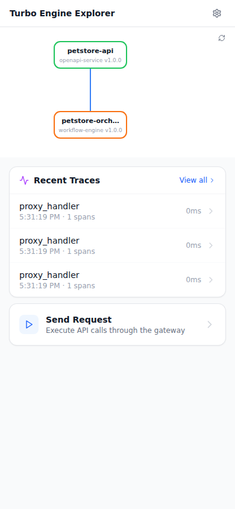

# k8s-e2e — PR #10, Run #31

[View workflow run](https://github.com/lennyburdette/turbo-engine/actions/runs/22261035755)

## Report

# Turbo Engine — K8s E2E Report

> Auto-generated by `hack/scripts/k8s-dump-report.sh`.
> Designed for consumption by Claude Code and human reviewers.

**Generated at:** 2026-02-21T17:32:03Z

---

## 1. Timeline

```
00:00  Waiting for control plane deployments to roll out
00:00  Control plane ready
00:00  Setting up port-forwards
00:07  Port-forwards healthy
00:07  Running scenario: petstore-basic
00:17  Scenario petstore-basic: 10/13 passed
00:17  Tests complete: 12 passed, 3 failed
```

---

## 2. Test Results

**Result: 3 FAILED** (12 passed, 15 total)

| Test | Status | Detail | Duration |
|------|--------|--------|----------|
| control-plane-rollout | PASS | All control plane deployments ready | 317ms |
| port-forward-health | PASS | All port-forwards healthy | 39ms |

---

## 3. Pod Status

```
NAME                                                READY   STATUS    RESTARTS   AGE   IP            NODE                             NOMINATED NODE   READINESS GATES
pod/builder-678474bf88-sfkml                        1/1     Running   0          34s   10.244.0.5    turbo-engine-e2e-control-plane   <none>           <none>
pod/console-78fbd5c84-rxrwm                         1/1     Running   0          34s   10.244.0.6    turbo-engine-e2e-control-plane   <none>           <none>
pod/deploy-petstore-api-bccd8b8c5-hbqhm             1/1     Running   0          10s   10.244.0.14   turbo-engine-e2e-control-plane   <none>           <none>
pod/deploy-petstore-orchestrator-864d54cc86-rd6fv   1/1     Running   0          10s   10.244.0.15   turbo-engine-e2e-control-plane   <none>           <none>
pod/envmanager-76c64c8cc9-fwlgv                     1/1     Running   0          34s   10.244.0.7    turbo-engine-e2e-control-plane   <none>           <none>
pod/explorer-5465b84fd-r27cb                        1/1     Running   0          34s   10.244.0.8    turbo-engine-e2e-control-plane   <none>           <none>
pod/gateway-586c64fdf5-zww2x                        1/1     Running   0          34s   10.244.0.9    turbo-engine-e2e-control-plane   <none>           <none>
pod/jaeger-54885dfdf-mbddh                          1/1     Running   0          34s   10.244.0.10   turbo-engine-e2e-control-plane   <none>           <none>
pod/otel-collector-8584bc4d4c-rz8xb                 1/1     Running   0          34s   10.244.0.11   turbo-engine-e2e-control-plane   <none>           <none>
pod/registry-7d5f66bcd8-k7c8g                       1/1     Running   0          34s   10.244.0.12   turbo-engine-e2e-control-plane   <none>           <none>
pod/turbo-engine-operator-7cd95f4bc4-xf7xz          1/1     Running   0          34s   10.244.0.13   turbo-engine-e2e-control-plane   <none>           <none>

NAME                                TYPE        CLUSTER-IP      EXTERNAL-IP   PORT(S)              AGE   SELECTOR
service/builder                     ClusterIP   10.96.16.39     <none>        8082/TCP             34s   app.kubernetes.io/managed-by=kustomize,app.kubernetes.io/name=builder,app.kubernetes.io/part-of=turbo-engine
service/console                     ClusterIP   10.96.140.190   <none>        3000/TCP             34s   app.kubernetes.io/managed-by=kustomize,app.kubernetes.io/name=console,app.kubernetes.io/part-of=turbo-engine
service/envmanager                  ClusterIP   10.96.225.7     <none>        8083/TCP             34s   app.kubernetes.io/managed-by=kustomize,app.kubernetes.io/name=envmanager,app.kubernetes.io/part-of=turbo-engine
service/explorer                    ClusterIP   10.96.235.18    <none>        3001/TCP             34s   app.kubernetes.io/managed-by=kustomize,app.kubernetes.io/name=explorer,app.kubernetes.io/part-of=turbo-engine
service/gateway                     ClusterIP   10.96.25.100    <none>        8080/TCP             34s   app.kubernetes.io/managed-by=kustomize,app.kubernetes.io/name=gateway,app.kubernetes.io/part-of=turbo-engine
service/jaeger                      ClusterIP   10.96.99.131    <none>        16686/TCP,4317/TCP   34s   app.kubernetes.io/managed-by=kustomize,app.kubernetes.io/name=jaeger,app.kubernetes.io/part-of=turbo-engine
service/otel-collector              ClusterIP   10.96.89.2      <none>        4317/TCP,4318/TCP    34s   app.kubernetes.io/managed-by=kustomize,app.kubernetes.io/name=otel-collector,app.kubernetes.io/part-of=turbo-engine
service/registry                    ClusterIP   10.96.155.118   <none>        8081/TCP             34s   app.kubernetes.io/managed-by=kustomize,app.kubernetes.io/name=registry,app.kubernetes.io/part-of=turbo-engine
service/svc-petstore-api            ClusterIP   10.96.41.31     <none>        8080/TCP             10s   app.kubernetes.io/instance=18a7456bee25bba1824272533860bcff,app.kubernetes.io/name=petstore-api
service/svc-petstore-orchestrator   ClusterIP   10.96.147.93    <none>        8080/TCP             10s   app.kubernetes.io/instance=18a7456bee25bba1824272533860bcff,app.kubernetes.io/name=petstore-orchestrator
service/turbo-engine-operator       ClusterIP   10.96.32.79     <none>        8084/TCP             34s   app.kubernetes.io/managed-by=kustomize,app.kubernetes.io/name=operator,app.kubernetes.io/part-of=turbo-engine

NAME                                           READY   UP-TO-DATE   AVAILABLE   AGE   CONTAINERS              IMAGES                                        SELECTOR
deployment.apps/builder                        1/1     1            1           34s   builder                 turbo-engine/builder:e2e                      app.kubernetes.io/managed-by=kustomize,app.kubernetes.io/name=builder,app.kubernetes.io/part-of=turbo-engine
deployment.apps/console                        1/1     1            1           34s   console                 turbo-engine/console:e2e                      app.kubernetes.io/managed-by=kustomize,app.kubernetes.io/name=console,app.kubernetes.io/part-of=turbo-engine
deployment.apps/deploy-petstore-api            1/1     1            1           10s   petstore-api            turbo-engine/petstore-mock:e2e                app.kubernetes.io/instance=18a7456bee25bba1824272533860bcff,app.kubernetes.io/name=petstore-api
deployment.apps/deploy-petstore-orchestrator   1/1     1            1           10s   petstore-orchestrator   turbo-engine/orchestrator:e2e                 app.kubernetes.io/instance=18a7456bee25bba1824272533860bcff,app.kubernetes.io/name=petstore-orchestrator
deployment.apps/envmanager                     1/1     1            1           34s   envmanager              turbo-engine/envmanager:e2e                   app.kubernetes.io/managed-by=kustomize,app.kubernetes.io/name=envmanager,app.kubernetes.io/part-of=turbo-engine
deployment.apps/explorer                       1/1     1            1           34s   explorer                turbo-engine/explorer:e2e                     app.kubernetes.io/managed-by=kustomize,app.kubernetes.io/name=explorer,app.kubernetes.io/part-of=turbo-engine
deployment.apps/gateway                        1/1     1            1           34s   gateway                 turbo-engine/gateway:e2e                      app.kubernetes.io/managed-by=kustomize,app.kubernetes.io/name=gateway,app.kubernetes.io/part-of=turbo-engine
deployment.apps/jaeger                         1/1     1            1           34s   jaeger                  jaegertracing/all-in-one:1.54                 app.kubernetes.io/managed-by=kustomize,app.kubernetes.io/name=jaeger,app.kubernetes.io/part-of=turbo-engine
deployment.apps/otel-collector                 1/1     1            1           34s   otel-collector          otel/opentelemetry-collector-contrib:0.96.0   app.kubernetes.io/managed-by=kustomize,app.kubernetes.io/name=otel-collector,app.kubernetes.io/part-of=turbo-engine
deployment.apps/registry                       1/1     1            1           34s   registry                turbo-engine/registry:e2e                     app.kubernetes.io/managed-by=kustomize,app.kubernetes.io/name=registry,app.kubernetes.io/part-of=turbo-engine
deployment.apps/turbo-engine-operator          1/1     1            1           34s   operator                turbo-engine/operator:e2e                     app.kubernetes.io/managed-by=kustomize,app.kubernetes.io/name=operator,app.kubernetes.io/part-of=turbo-engine

NAME                                                      DESIRED   CURRENT   READY   AGE   CONTAINERS              IMAGES                                        SELECTOR
replicaset.apps/builder-678474bf88                        1         1         1       34s   builder                 turbo-engine/builder:e2e                      app.kubernetes.io/managed-by=kustomize,app.kubernetes.io/name=builder,app.kubernetes.io/part-of=turbo-engine,pod-template-hash=678474bf88
replicaset.apps/console-78fbd5c84                         1         1         1       34s   console                 turbo-engine/console:e2e                      app.kubernetes.io/managed-by=kustomize,app.kubernetes.io/name=console,app.kubernetes.io/part-of=turbo-engine,pod-template-hash=78fbd5c84
replicaset.apps/deploy-petstore-api-bccd8b8c5             1         1         1       10s   petstore-api            turbo-engine/petstore-mock:e2e                app.kubernetes.io/instance=18a7456bee25bba1824272533860bcff,app.kubernetes.io/name=petstore-api,pod-template-hash=bccd8b8c5
replicaset.apps/deploy-petstore-orchestrator-864d54cc86   1         1         1       10s   petstore-orchestrator   turbo-engine/orchestrator:e2e                 app.kubernetes.io/instance=18a7456bee25bba1824272533860bcff,app.kubernetes.io/name=petstore-orchestrator,pod-template-hash=864d54cc86
replicaset.apps/envmanager-76c64c8cc9                     1         1         1       34s   envmanager              turbo-engine/envmanager:e2e                   app.kubernetes.io/managed-by=kustomize,app.kubernetes.io/name=envmanager,app.kubernetes.io/part-of=turbo-engine,pod-template-hash=76c64c8cc9
replicaset.apps/explorer-5465b84fd                        1         1         1       34s   explorer                turbo-engine/explorer:e2e                     app.kubernetes.io/managed-by=kustomize,app.kubernetes.io/name=explorer,app.kubernetes.io/part-of=turbo-engine,pod-template-hash=5465b84fd
replicaset.apps/gateway-586c64fdf5                        1         1         1       34s   gateway                 turbo-engine/gateway:e2e                      app.kubernetes.io/managed-by=kustomize,app.kubernetes.io/name=gateway,app.kubernetes.io/part-of=turbo-engine,pod-template-hash=586c64fdf5
replicaset.apps/jaeger-54885dfdf                          1         1         1       34s   jaeger                  jaegertracing/all-in-one:1.54                 app.kubernetes.io/managed-by=kustomize,app.kubernetes.io/name=jaeger,app.kubernetes.io/part-of=turbo-engine,pod-template-hash=54885dfdf
replicaset.apps/otel-collector-8584bc4d4c                 1         1         1       34s   otel-collector          otel/opentelemetry-collector-contrib:0.96.0   app.kubernetes.io/managed-by=kustomize,app.kubernetes.io/name=otel-collector,app.kubernetes.io/part-of=turbo-engine,pod-template-hash=8584bc4d4c
replicaset.apps/registry-7d5f66bcd8                       1         1         1       34s   registry                turbo-engine/registry:e2e                     app.kubernetes.io/managed-by=kustomize,app.kubernetes.io/name=registry,app.kubernetes.io/part-of=turbo-engine,pod-template-hash=7d5f66bcd8
replicaset.apps/turbo-engine-operator-7cd95f4bc4          1         1         1       34s   operator                turbo-engine/operator:e2e                     app.kubernetes.io/managed-by=kustomize,app.kubernetes.io/name=operator,app.kubernetes.io/part-of=turbo-engine,pod-template-hash=7cd95f4bc4
```

---

## 4. Operator Reconciliation Actions

**Total actions:** 18

| Time | Action | Kind | Resource | Details |
|------|--------|------|----------|----------|
| 17:31:09 | reconcile request received |  |  |  |
| 17:31:09 | starting reconciliation |  |  |  |
| 17:31:09 | Create | Deployment | deploy-petstore-api | image=artifact:petstore-api-hash replicas=1 |
| 17:31:09 | Create | Service | svc-petstore-api | selector=petstore-api |
| 17:31:09 | Create | ConfigMap | cm-petstore-api | env_vars=0 |
| 17:31:09 | Create | Deployment | deploy-petstore-orchestrator | image=artifact:petstore-orchestrator-hash replicas=1 |
| 17:31:09 | Create | Service | svc-petstore-orchestrator | selector=petstore-orchestrator |
| 17:31:09 | Create | ConfigMap | cm-petstore-orchestrator | env_vars=1 |
| 17:31:09 | Create | Ingress | localhost-ingress | host=localhost routes=1 tls=false |
| 17:31:09 | Create | Deployment | deploy-petstore-api | image=artifact:petstore-api-hash replicas=1 |
| 17:31:09 | Create | Service | svc-petstore-api | selector=petstore-api |
| 17:31:09 | Create | ConfigMap | cm-petstore-api | env_vars=0 |
| 17:31:09 | Create | Deployment | deploy-petstore-orchestrator | image=artifact:petstore-orchestrator-hash replicas=1 |
| 17:31:09 | Create | Service | svc-petstore-orchestrator | selector=petstore-orchestrator |
| 17:31:09 | Create | ConfigMap | cm-petstore-orchestrator | env_vars=1 |
| 17:31:10 | Create | Ingress | localhost-ingress | host=localhost routes=1 tls=false |
| 17:31:10 | Create |  | localhost-ingress |  |
| 17:31:10 | reconciliation complete |  |  | Running |

---

## 5. Trace Summary

**Captured at:** unknown


[**Open trace viewer →**](./traces.html)

<details><summary>Textual trace summary (for automated analysis)</summary>

```
Trace Summary (captured 2026-02-21T17:32:03Z)
============================================================

builder: 27 traces, 36 spans
  [0ec3f2173dc2] builder/builder 0.1ms (1 spans)
  [729e75716cad] builder/builder 0.0ms (1 spans)
  [40b594929842] builder/builder 0.0ms (1 spans)
  [8366d179514c] builder/builder 0.0ms (1 spans)
  [004f0bf92feb] builder/builder 0.0ms (1 spans)
  [b052fa359555] builder/builder 0.1ms (1 spans)
  [b14cfc6f8467] builder/builder 0.0ms (1 spans)
  [8ac8ed392bb4] builder/builder 0.0ms (1 spans)
  [151487847992] builder/builder 0.0ms (1 spans)
  [fc82b8437320] builder/builder 0.0ms (1 spans)
  [d00384b8e830] builder/builder 0.0ms (1 spans)
  [f3909f5b6e88] builder/builder 0.0ms (1 spans)
  [3e0ad141a5ae] builder/builder 0.0ms (1 spans)
  [e40bf10261e0] builder/builder 0.0ms (1 spans)
  [90ea3cdd638a] builder/builder 0.1ms (1 spans)
  [ddbb54bd1e5a] builder/builder 0.0ms (1 spans)
  [a8259f50ff76] builder/builder 0.3ms (10 spans)
    builder/BuildEngine.Run 0.5ms
    builder/step.resolve 0.0ms
    builder/resolve.execute 0.0ms
    builder/step.compose 0.0ms
    builder/compose.execute 0.0ms
    builder/step.validate 0.0ms
    builder/validate.execute 0.0ms
    builder/step.bundle 0.0ms
    builder/bundle.execute 0.0ms
  [d39a5a664b27] builder/builder 0.0ms (1 spans)
  [28701fd3f234] builder/builder 0.0ms (1 spans)
  [3be73a5948c9] builder/builder 0.0ms (1 spans)
  [e865ecf21d17] builder/builder 0.0ms (1 spans)
  [30fcb819aa56] builder/builder 0.0ms (1 spans)
  [3fa70dbe2a46] builder/builder 0.1ms (1 spans)
  [5ae781bd3fe3] builder/builder 0.0ms (1 spans)
  [3be489596998] builder/builder 0.1ms (1 spans)
  [315139454b5a] builder/builder 0.0ms (1 spans)
  [5076f0cf2929] builder/builder 0.0ms (1 spans)

envmanager: 16 traces, 19 spans
  [55b3f962df82] envmanager/envmanager 0.1ms (1 spans)
  [92ca2a1ea190] envmanager/envmanager 0.0ms (1 spans)
  [08ad0bbe0380] envmanager/envmanager 0.0ms (1 spans)
  [782304fd9916] envmanager/envmanager 0.0ms (1 spans)
  [5323405cadbb] envmanager/envmanager 0.0ms (1 spans)
  [336338b5b066] envmanager/envmanager 0.1ms (2 spans)
    envmanager/Orchestrator.ListEnvironments 0.0ms
  [1ce35056fbf8] envmanager/envmanager 0.1ms (1 spans)
  [2365d83f39fc] envmanager/envmanager 0.0ms (1 spans)
  [57835d9d3555] envmanager/envmanager 0.1ms (1 spans)
  [1af19f65e37a] envmanager/envmanager 0.0ms (1 spans)
  [02bb33f0e767] envmanager/envmanager 0.1ms (2 spans)
    envmanager/Orchestrator.ListEnvironments 0.0ms
  [92f8c9f82a4c] envmanager/envmanager 0.0ms (1 spans)
  [24754691a802] envmanager/envmanager 0.0ms (1 spans)
  [e38845890bdd] envmanager/envmanager 0.0ms (1 spans)
  [74f087715d3e] envmanager/envmanager 0.2ms (2 spans)
    envmanager/Orchestrator.CreateEnvironment 0.0ms
  [e8d407f77601] envmanager/envmanager 0.0ms (1 spans)

gateway: 3 traces, 3 spans
  [a0b1c2d3e4f5] gateway/proxy_handler 0.0ms (1 spans)
  [7960e6a6ab2a] gateway/proxy_handler 0.0ms (1 spans)
  [e3a3911c5b8c] gateway/proxy_handler 0.0ms (1 spans)

operator: no traces
orchestrator: 1 traces, 4 spans
  [02d9f2d2b382] orchestrator/orchestrator 1.5ms (4 spans)
    orchestrator/rpc/listPets 1.4ms
    orchestrator/HTTP GET 1.3ms
    petstore-mock/petstore-mock 0.1ms

petstore-mock: 2 traces, 5 spans
  [4896391647bb] petstore-mock/petstore-mock 0.2ms (1 spans)
  [02d9f2d2b382] orchestrator/orchestrator 1.5ms (4 spans)
    orchestrator/rpc/listPets 1.4ms
    orchestrator/HTTP GET 1.3ms
    petstore-mock/petstore-mock 0.1ms

registry: 5 traces, 5 spans
  [53199d7c7cb2] registry/ListPackages 0.1ms (1 spans)
  [7a357c2625ea] registry/ListPackages 0.1ms (1 spans)
  [a61829e6d879] registry/PublishPackage 0.0ms (1 spans)
  [957473e48354] registry/PublishPackage 0.2ms (1 spans)
  [a4734feb784d] registry/ListPackages 0.2ms (1 spans)

Total: 54 traces, 72 spans across 7 services
```

</details>

_Full trace data: `ci-report/traces.json` (88951 bytes)_

---

## 6. Screenshots

| Page | File | Size |
|------|------|------|
| dashboard | `ci-report/screenshots/dashboard.png` | 53178 bytes |
| environments | `ci-report/screenshots/environments.png` | 37579 bytes |
| explorer | `ci-report/screenshots/explorer.png` | 34509 bytes |
| packages | `ci-report/screenshots/packages.png` | 43272 bytes |

---

## 7. Service Logs (last 200 lines each)

### registry

```
{"time":"2026-02-21T17:30:46.601903513Z","level":"INFO","msg":"starting registry service","port":"8081"}
{"time":"2026-02-21T17:31:09.909642576Z","level":"INFO","msg":"published package","id":"pkg_1","name":"petstore-api","version":"1.0.0"}
{"time":"2026-02-21T17:31:09.911999418Z","level":"INFO","msg":"published package","id":"pkg_2","name":"petstore-orchestrator","version":"1.0.0"}
```

### builder

```
{"time":"2026-02-21T17:30:46.287178876Z","level":"INFO","msg":"builder service starting","port":"8082"}
{"time":"2026-02-21T17:31:09.9168579Z","level":"INFO","msg":"build created","build_id":"bld-1771695069916-1","environment_id":"18a7456bee25bba1824272533860bcff"}
{"time":"2026-02-21T17:31:09.917492699Z","level":"INFO","msg":"build completed successfully","build_id":"bld-1771695069916-1"}
```

### envmanager

```
{"time":"2026-02-21T17:30:46.348405372Z","level":"INFO","msg":"starting server","addr":":8083"}
{"time":"2026-02-21T17:31:09.914391442Z","level":"INFO","msg":"environment created","id":"18a7456bee25bba1824272533860bcff","name":"petstore-e2e"}
```

### turbo-engine-operator

```
{"time":"2026-02-21T17:30:46.728851259Z","level":"INFO","msg":"starting operator service","version":"0.1.0","log_level":"debug"}
{"time":"2026-02-21T17:30:46.729375414Z","level":"WARN","msg":"failed to initialize tracer, continuing without tracing","error":"creating resource: conflicting Schema URL: https://opentelemetry.io/schemas/1.26.0 and https://opentelemetry.io/schemas/1.24.0"}
{"time":"2026-02-21T17:30:46.729392145Z","level":"INFO","msg":"operator mode: k8s — will create real Kubernetes resources"}
{"time":"2026-02-21T17:30:46.729904386Z","level":"INFO","msg":"starting builder poll loop","component":"poller","builder_url":"http://builder:8082","interval":5000000000}
{"time":"2026-02-21T17:30:46.729933976Z","level":"INFO","msg":"listening","addr":":8084"}
{"time":"2026-02-21T17:30:51.731461818Z","level":"DEBUG","msg":"failed to poll builder (will retry)","component":"poller","builder_url":"http://builder:8082","error":"Get \"http://builder:8082/v1/graphs\": dial tcp 10.96.16.39:8082: connect: connection refused"}
{"time":"2026-02-21T17:30:56.735101096Z","level":"DEBUG","msg":"failed to poll builder (will retry)","component":"poller","builder_url":"http://builder:8082","error":"Get \"http://builder:8082/v1/graphs\": dial tcp 10.96.16.39:8082: connect: connection refused"}
{"time":"2026-02-21T17:31:01.732206843Z","level":"WARN","msg":"builder returned non-200 status","component":"poller","builder_url":"http://builder:8082","status":404}
{"time":"2026-02-21T17:31:06.735411368Z","level":"WARN","msg":"builder returned non-200 status","component":"poller","builder_url":"http://builder:8082","status":404}
{"time":"2026-02-21T17:31:09.594738941Z","level":"INFO","msg":"gateway config request","component":"handler","routes":0}
{"time":"2026-02-21T17:31:09.92184999Z","level":"INFO","msg":"reconcile request received","component":"handler","environment_id":"18a7456bee25bba1824272533860bcff","build_id":"bld-1771695069916-1"}
{"time":"2026-02-21T17:31:09.921882188Z","level":"INFO","msg":"starting reconciliation","component":"reconciler","environment_id":"18a7456bee25bba1824272533860bcff","build_id":"bld-1771695069916-1","components":2}
{"time":"2026-02-21T17:31:09.921903994Z","level":"INFO","msg":"reconciliation action","component":"reconciler","environment_id":"18a7456bee25bba1824272533860bcff","action":"Create","resource_kind":"Deployment","resource_name":"deploy-petstore-api","details":"image=artifact:petstore-api-hash replicas=1"}
{"time":"2026-02-21T17:31:09.921916685Z","level":"INFO","msg":"reconciliation action","component":"reconciler","environment_id":"18a7456bee25bba1824272533860bcff","action":"Create","resource_kind":"Service","resource_name":"svc-petstore-api","details":"selector=petstore-api"}
{"time":"2026-02-21T17:31:09.921920745Z","level":"INFO","msg":"reconciliation action","component":"reconciler","environment_id":"18a7456bee25bba1824272533860bcff","action":"Create","resource_kind":"ConfigMap","resource_name":"cm-petstore-api","details":"env_vars=0"}
{"time":"2026-02-21T17:31:09.92192518Z","level":"INFO","msg":"reconciliation action","component":"reconciler","environment_id":"18a7456bee25bba1824272533860bcff","action":"Create","resource_kind":"Deployment","resource_name":"deploy-petstore-orchestrator","details":"image=artifact:petstore-orchestrator-hash replicas=1"}
{"time":"2026-02-21T17:31:09.92193021Z","level":"INFO","msg":"reconciliation action","component":"reconciler","environment_id":"18a7456bee25bba1824272533860bcff","action":"Create","resource_kind":"Service","resource_name":"svc-petstore-orchestrator","details":"selector=petstore-orchestrator"}
{"time":"2026-02-21T17:31:09.921935053Z","level":"INFO","msg":"reconciliation action","component":"reconciler","environment_id":"18a7456bee25bba1824272533860bcff","action":"Create","resource_kind":"ConfigMap","resource_name":"cm-petstore-orchestrator","details":"env_vars=1"}
{"time":"2026-02-21T17:31:09.921937987Z","level":"INFO","msg":"reconciliation action","component":"reconciler","environment_id":"18a7456bee25bba1824272533860bcff","action":"Create","resource_kind":"Ingress","resource_name":"localhost-ingress","details":"host=localhost routes=1 tls=false"}
{"time":"2026-02-21T17:31:09.921941556Z","level":"INFO","msg":"applying action","component":"k8s-applier","type":"Create","kind":"Deployment","name":"deploy-petstore-api","details":"image=artifact:petstore-api-hash replicas=1"}
{"time":"2026-02-21T17:31:09.93106567Z","level":"INFO","msg":"applying action","component":"k8s-applier","type":"Create","kind":"Service","name":"svc-petstore-api","details":"selector=petstore-api"}
{"time":"2026-02-21T17:31:09.938581322Z","level":"INFO","msg":"applying action","component":"k8s-applier","type":"Create","kind":"ConfigMap","name":"cm-petstore-api","details":"env_vars=0"}
{"time":"2026-02-21T17:31:09.944652372Z","level":"INFO","msg":"applying action","component":"k8s-applier","type":"Create","kind":"Deployment","name":"deploy-petstore-orchestrator","details":"image=artifact:petstore-orchestrator-hash replicas=1"}
{"time":"2026-02-21T17:31:09.952505254Z","level":"INFO","msg":"applying action","component":"k8s-applier","type":"Create","kind":"Service","name":"svc-petstore-orchestrator","details":"selector=petstore-orchestrator"}
{"time":"2026-02-21T17:31:09.959844286Z","level":"INFO","msg":"applying action","component":"k8s-applier","type":"Create","kind":"ConfigMap","name":"cm-petstore-orchestrator","details":"env_vars=1"}
{"time":"2026-02-21T17:31:10.009770872Z","level":"INFO","msg":"applying action","component":"k8s-applier","type":"Create","kind":"Ingress","name":"localhost-ingress","details":"host=localhost routes=1 tls=false"}
{"time":"2026-02-21T17:31:10.009801005Z","level":"INFO","msg":"ingress action handled via gateway-config endpoint","component":"k8s-applier","type":"Create","name":"localhost-ingress"}
{"time":"2026-02-21T17:31:10.009819491Z","level":"INFO","msg":"reconciliation complete","component":"reconciler","environment_id":"18a7456bee25bba1824272533860bcff","phase":"Running","actions":7}
{"time":"2026-02-21T17:31:11.731255408Z","level":"WARN","msg":"builder returned non-200 status","component":"poller","builder_url":"http://builder:8082","status":404}
{"time":"2026-02-21T17:31:16.731395147Z","level":"WARN","msg":"builder returned non-200 status","component":"poller","builder_url":"http://builder:8082","status":404}
```

### gateway

```
2026-02-21T17:30:46.422241Z  INFO gateway: starting gateway port=8080 config_url=Some("http://turbo-engine-operator:8084/v1/gateway-config")
2026-02-21T17:30:46.694816Z  WARN gateway: config not available yet, retrying err=upstream unavailable: error sending request for url (http://turbo-engine-operator:8084/v1/gateway-config) attempt=1 max_attempts=4
2026-02-21T17:30:47.899860Z  WARN gateway: config not available yet, retrying err=upstream unavailable: error sending request for url (http://turbo-engine-operator:8084/v1/gateway-config) attempt=2 max_attempts=4
2026-02-21T17:30:50.199214Z  WARN gateway: config not available yet, retrying err=upstream unavailable: error sending request for url (http://turbo-engine-operator:8084/v1/gateway-config) attempt=3 max_attempts=4
2026-02-21T17:30:54.393919Z  WARN gateway: failed to load config after retries — starting with empty routing table err=upstream unavailable: error sending request for url (http://turbo-engine-operator:8084/v1/gateway-config)
2026-02-21T17:30:54.600102Z  INFO gateway: gateway listening addr=0.0.0.0:8080
2026-02-21T17:31:09.595390Z  INFO gateway::config: config reloaded routes=0
```

### console

```
/docker-entrypoint.sh: /docker-entrypoint.d/ is not empty, will attempt to perform configuration
/docker-entrypoint.sh: Looking for shell scripts in /docker-entrypoint.d/
/docker-entrypoint.sh: Launching /docker-entrypoint.d/10-listen-on-ipv6-by-default.sh
10-listen-on-ipv6-by-default.sh: info: Getting the checksum of /etc/nginx/conf.d/default.conf
10-listen-on-ipv6-by-default.sh: info: /etc/nginx/conf.d/default.conf differs from the packaged version
/docker-entrypoint.sh: Sourcing /docker-entrypoint.d/15-local-resolvers.envsh
/docker-entrypoint.sh: Launching /docker-entrypoint.d/20-envsubst-on-templates.sh
/docker-entrypoint.sh: Launching /docker-entrypoint.d/30-tune-worker-processes.sh
/docker-entrypoint.sh: Configuration complete; ready for start up
2026/02/21 17:30:46 [notice] 1#1: using the "epoll" event method
2026/02/21 17:30:46 [notice] 1#1: nginx/1.27.5
2026/02/21 17:30:46 [notice] 1#1: built by gcc 14.2.0 (Alpine 14.2.0) 
2026/02/21 17:30:46 [notice] 1#1: OS: Linux 6.11.0-1018-azure
2026/02/21 17:30:46 [notice] 1#1: getrlimit(RLIMIT_NOFILE): 1048576:1048576
2026/02/21 17:30:46 [notice] 1#1: start worker processes
2026/02/21 17:30:46 [notice] 1#1: start worker process 36
2026/02/21 17:30:46 [notice] 1#1: start worker process 37
2026/02/21 17:30:46 [notice] 1#1: start worker process 38
2026/02/21 17:30:46 [notice] 1#1: start worker process 39
10.244.0.1 - - [21/Feb/2026:17:30:58 +0000] "GET / HTTP/1.1" 200 635 "-" "kube-probe/1.35" "-"
10.244.0.1 - - [21/Feb/2026:17:31:00 +0000] "GET / HTTP/1.1" 200 635 "-" "kube-probe/1.35" "-"
10.244.0.1 - - [21/Feb/2026:17:31:08 +0000] "GET / HTTP/1.1" 200 635 "-" "kube-probe/1.35" "-"
10.244.0.1 - - [21/Feb/2026:17:31:15 +0000] "GET / HTTP/1.1" 200 635 "-" "kube-probe/1.35" "-"
10.244.0.1 - - [21/Feb/2026:17:31:18 +0000] "GET / HTTP/1.1" 200 635 "-" "kube-probe/1.35" "-"
```

### Operator-deployed components

#### petstore-basic-petstore-api

```
{"level":"info","msg":"petstore mock starting","port":"8080","time":"2026-02-21T17:31:10.433866837Z"}
{"level":"info","method":"GET","msg":"request received","path":"/pets","query":"","time":"2026-02-21T17:31:17.588959166Z","trace_id":"","traceparent":"","x_request_id":""}
{"duration_ms":0,"level":"info","method":"GET","msg":"response sent","path":"/pets","status":200,"time":"2026-02-21T17:31:17.589076306Z","trace_id":""}
{"level":"info","method":"GET","msg":"request received","path":"/pets","query":"","time":"2026-02-21T17:31:19.595123495Z","trace_id":"02d9f2d2b38218609ccd0346d78c6783","traceparent":"00-02d9f2d2b38218609ccd0346d78c6783-751bbc02c437c1a6-01","x_request_id":""}
{"duration_ms":0,"level":"info","method":"GET","msg":"response sent","path":"/pets","status":200,"time":"2026-02-21T17:31:19.595163936Z","trace_id":"02d9f2d2b38218609ccd0346d78c6783"}```

#### petstore-basic-petstore-orchestrator

```
{"level":"info","msg":"orchestrator starting","port":"8080","time":"2026-02-21T17:31:10.464592489Z","upstream_url":"http://svc-petstore-api:8080"}
{"level":"info","method":"POST","msg":"request received","path":"/rpc/listPets","query":"","time":"2026-02-21T17:31:19.593963033Z","trace_id":"","traceparent":"","x_request_id":""}
{"level":"info","method":"GET","msg":"upstream call start","rpc":"listPets","time":"2026-02-21T17:31:19.59402821Z","trace_id":"","url":"http://svc-petstore-api:8080/pets"}
{"duration_ms":1,"level":"info","msg":"upstream call complete","response_bytes":240,"rpc":"listPets","time":"2026-02-21T17:31:19.595334707Z","trace_id":"","upstream_status":200,"url":"http://svc-petstore-api:8080/pets"}
{"duration_ms":1,"level":"info","method":"POST","msg":"response sent","path":"/rpc/listPets","status":200,"time":"2026-02-21T17:31:19.595428218Z","trace_id":""}```

---

## 8. Errors and Warnings

Scanning logs for errors, panics, and warnings...

### turbo-engine-operator

```
{"time":"2026-02-21T17:30:46.729375414Z","level":"WARN","msg":"failed to initialize tracer, continuing without tracing","error":"creating resource: conflicting Schema URL: https://opentelemetry.io/schemas/1.26.0 and https://opentelemetry.io/schemas/1.24.0"}
{"time":"2026-02-21T17:31:01.732206843Z","level":"WARN","msg":"builder returned non-200 status","component":"poller","builder_url":"http://builder:8082","status":404}
{"time":"2026-02-21T17:31:06.735411368Z","level":"WARN","msg":"builder returned non-200 status","component":"poller","builder_url":"http://builder:8082","status":404}
{"time":"2026-02-21T17:31:11.731255408Z","level":"WARN","msg":"builder returned non-200 status","component":"poller","builder_url":"http://builder:8082","status":404}
{"time":"2026-02-21T17:31:16.731395147Z","level":"WARN","msg":"builder returned non-200 status","component":"poller","builder_url":"http://builder:8082","status":404}
```

---

## 9. Kubernetes Events

```
LAST SEEN   TYPE     REASON              OBJECT                                               MESSAGE
35s         Normal   Scheduled           pod/jaeger-54885dfdf-mbddh                           Successfully assigned turbo-engine-e2e/jaeger-54885dfdf-mbddh to turbo-engine-e2e-control-plane
35s         Normal   Scheduled           pod/registry-7d5f66bcd8-k7c8g                        Successfully assigned turbo-engine-e2e/registry-7d5f66bcd8-k7c8g to turbo-engine-e2e-control-plane
35s         Normal   ScalingReplicaSet   deployment/otel-collector                            Scaled up replica set otel-collector-8584bc4d4c from 0 to 1
35s         Normal   Scheduled           pod/builder-678474bf88-sfkml                         Successfully assigned turbo-engine-e2e/builder-678474bf88-sfkml to turbo-engine-e2e-control-plane
35s         Normal   SuccessfulCreate    replicaset/envmanager-76c64c8cc9                     Created pod: envmanager-76c64c8cc9-fwlgv
35s         Normal   ScalingReplicaSet   deployment/builder                                   Scaled up replica set builder-678474bf88 from 0 to 1
35s         Normal   Scheduled           pod/console-78fbd5c84-rxrwm                          Successfully assigned turbo-engine-e2e/console-78fbd5c84-rxrwm to turbo-engine-e2e-control-plane
35s         Normal   Scheduled           pod/otel-collector-8584bc4d4c-rz8xb                  Successfully assigned turbo-engine-e2e/otel-collector-8584bc4d4c-rz8xb to turbo-engine-e2e-control-plane
35s         Normal   ScalingReplicaSet   deployment/jaeger                                    Scaled up replica set jaeger-54885dfdf from 0 to 1
35s         Normal   SuccessfulCreate    replicaset/jaeger-54885dfdf                          Created pod: jaeger-54885dfdf-mbddh
35s         Normal   SuccessfulCreate    replicaset/console-78fbd5c84                         Created pod: console-78fbd5c84-rxrwm
35s         Normal   ScalingReplicaSet   deployment/console                                   Scaled up replica set console-78fbd5c84 from 0 to 1
35s         Normal   Pulled              pod/builder-678474bf88-sfkml                         Container image "turbo-engine/builder:e2e" already present on machine and can be accessed by the pod
35s         Normal   ScalingReplicaSet   deployment/turbo-engine-operator                     Scaled up replica set turbo-engine-operator-7cd95f4bc4 from 0 to 1
35s         Normal   SuccessfulCreate    replicaset/builder-678474bf88                        Created pod: builder-678474bf88-sfkml
35s         Normal   ScalingReplicaSet   deployment/gateway                                   Scaled up replica set gateway-586c64fdf5 from 0 to 1
35s         Normal   SuccessfulCreate    replicaset/gateway-586c64fdf5                        Created pod: gateway-586c64fdf5-zww2x
35s         Normal   Scheduled           pod/turbo-engine-operator-7cd95f4bc4-xf7xz           Successfully assigned turbo-engine-e2e/turbo-engine-operator-7cd95f4bc4-xf7xz to turbo-engine-e2e-control-plane
35s         Normal   ScalingReplicaSet   deployment/registry                                  Scaled up replica set registry-7d5f66bcd8 from 0 to 1
35s         Normal   SuccessfulCreate    replicaset/registry-7d5f66bcd8                       Created pod: registry-7d5f66bcd8-k7c8g
35s         Normal   Scheduled           pod/gateway-586c64fdf5-zww2x                         Successfully assigned turbo-engine-e2e/gateway-586c64fdf5-zww2x to turbo-engine-e2e-control-plane
35s         Normal   ScalingReplicaSet   deployment/explorer                                  Scaled up replica set explorer-5465b84fd from 0 to 1
35s         Normal   SuccessfulCreate    replicaset/explorer-5465b84fd                        Created pod: explorer-5465b84fd-r27cb
35s         Normal   SuccessfulCreate    replicaset/turbo-engine-operator-7cd95f4bc4          Created pod: turbo-engine-operator-7cd95f4bc4-xf7xz
35s         Normal   Scheduled           pod/envmanager-76c64c8cc9-fwlgv                      Successfully assigned turbo-engine-e2e/envmanager-76c64c8cc9-fwlgv to turbo-engine-e2e-control-plane
35s         Normal   Scheduled           pod/explorer-5465b84fd-r27cb                         Successfully assigned turbo-engine-e2e/explorer-5465b84fd-r27cb to turbo-engine-e2e-control-plane
35s         Normal   SuccessfulCreate    replicaset/otel-collector-8584bc4d4c                 Created pod: otel-collector-8584bc4d4c-rz8xb
35s         Normal   ScalingReplicaSet   deployment/envmanager                                Scaled up replica set envmanager-76c64c8cc9 from 0 to 1
34s         Normal   Created             pod/envmanager-76c64c8cc9-fwlgv                      Container created
34s         Normal   Created             pod/turbo-engine-operator-7cd95f4bc4-xf7xz           Container created
34s         Normal   Pulled              pod/envmanager-76c64c8cc9-fwlgv                      Container image "turbo-engine/envmanager:e2e" already present on machine and can be accessed by the pod
34s         Normal   Pulled              pod/explorer-5465b84fd-r27cb                         Container image "turbo-engine/explorer:e2e" already present on machine and can be accessed by the pod
34s         Normal   Created             pod/explorer-5465b84fd-r27cb                         Container created
34s         Normal   Started             pod/explorer-5465b84fd-r27cb                         Container started
34s         Normal   Pulled              pod/registry-7d5f66bcd8-k7c8g                        Container image "turbo-engine/registry:e2e" already present on machine and can be accessed by the pod
34s         Normal   Created             pod/registry-7d5f66bcd8-k7c8g                        Container created
34s         Normal   Started             pod/registry-7d5f66bcd8-k7c8g                        Container started
34s         Normal   Pulled              pod/gateway-586c64fdf5-zww2x                         Container image "turbo-engine/gateway:e2e" already present on machine and can be accessed by the pod
34s         Normal   Created             pod/gateway-586c64fdf5-zww2x                         Container created
34s         Normal   Started             pod/gateway-586c64fdf5-zww2x                         Container started
34s         Normal   Pulled              pod/turbo-engine-operator-7cd95f4bc4-xf7xz           Container image "turbo-engine/operator:e2e" already present on machine and can be accessed by the pod
34s         Normal   Started             pod/envmanager-76c64c8cc9-fwlgv                      Container started
34s         Normal   Started             pod/turbo-engine-operator-7cd95f4bc4-xf7xz           Container started
34s         Normal   Pulling             pod/jaeger-54885dfdf-mbddh                           Pulling image "jaegertracing/all-in-one:1.54"
34s         Normal   Created             pod/builder-678474bf88-sfkml                         Container created
34s         Normal   Started             pod/builder-678474bf88-sfkml                         Container started
34s         Normal   Pulling             pod/otel-collector-8584bc4d4c-rz8xb                  Pulling image "otel/opentelemetry-collector-contrib:0.96.0"
34s         Normal   Started             pod/console-78fbd5c84-rxrwm                          Container started
34s         Normal   Created             pod/console-78fbd5c84-rxrwm                          Container created
34s         Normal   Pulled              pod/console-78fbd5c84-rxrwm                          Container image "turbo-engine/console:e2e" already present on machine and can be accessed by the pod
32s         Normal   Started             pod/jaeger-54885dfdf-mbddh                           Container started
32s         Normal   Created             pod/jaeger-54885dfdf-mbddh                           Container created
32s         Normal   Pulled              pod/jaeger-54885dfdf-mbddh                           Successfully pulled image "jaegertracing/all-in-one:1.54" in 1.859s (1.859s including waiting). Image size: 33344095 bytes.
30s         Normal   Pulled              pod/otel-collector-8584bc4d4c-rz8xb                  Successfully pulled image "otel/opentelemetry-collector-contrib:0.96.0" in 2.52s (4.222s including waiting). Image size: 65128183 bytes.
30s         Normal   Started             pod/otel-collector-8584bc4d4c-rz8xb                  Container started
30s         Normal   Created             pod/otel-collector-8584bc4d4c-rz8xb                  Container created
11s         Normal   SuccessfulCreate    replicaset/deploy-petstore-api-bccd8b8c5             Created pod: deploy-petstore-api-bccd8b8c5-hbqhm
11s         Normal   SuccessfulCreate    replicaset/deploy-petstore-orchestrator-864d54cc86   Created pod: deploy-petstore-orchestrator-864d54cc86-rd6fv
11s         Normal   Scheduled           pod/deploy-petstore-orchestrator-864d54cc86-rd6fv    Successfully assigned turbo-engine-e2e/deploy-petstore-orchestrator-864d54cc86-rd6fv to turbo-engine-e2e-control-plane
11s         Normal   ScalingReplicaSet   deployment/deploy-petstore-api                       Scaled up replica set deploy-petstore-api-bccd8b8c5 from 0 to 1
11s         Normal   ScalingReplicaSet   deployment/deploy-petstore-orchestrator              Scaled up replica set deploy-petstore-orchestrator-864d54cc86 from 0 to 1
11s         Normal   Scheduled           pod/deploy-petstore-api-bccd8b8c5-hbqhm              Successfully assigned turbo-engine-e2e/deploy-petstore-api-bccd8b8c5-hbqhm to turbo-engine-e2e-control-plane
10s         Normal   Started             pod/deploy-petstore-orchestrator-864d54cc86-rd6fv    Container started
10s         Normal   Created             pod/deploy-petstore-orchestrator-864d54cc86-rd6fv    Container created
10s         Normal   Pulled              pod/deploy-petstore-orchestrator-864d54cc86-rd6fv    Container image "turbo-engine/orchestrator:e2e" already present on machine and can be accessed by the pod
10s         Normal   Started             pod/deploy-petstore-api-bccd8b8c5-hbqhm              Container started
10s         Normal   Created             pod/deploy-petstore-api-bccd8b8c5-hbqhm              Container created
10s         Normal   Pulled              pod/deploy-petstore-api-bccd8b8c5-hbqhm              Container image "turbo-engine/petstore-mock:e2e" already present on machine and can be accessed by the pod
```

---

_End of K8s E2E Report. For full data see `ci-report/` directory._

## Screenshots

### dashboard


### environments


### explorer


### packages


