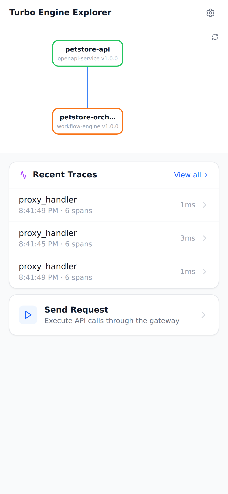

# petstore-basic: ALL 14 TESTS PASSED

> Petstore API with RPC-to-REST orchestrator. Validates the full request chain: gateway → orchestrator → upstream API, including trace propagation.


## Test Results

| Test | Result | Detail | Time |
|------|--------|--------|------|
| publish-petstore-api | PASS | Published petstore-api@1.0.0 (HTTP 201) | 26ms |
| publish-petstore-orchestrator | PASS | Published petstore-orchestrator@1.0.0 (HTTP 201) | 2ms |
| create-environment | PASS | Created aeeea48ca75a8fffc9969fc7d14a7a94 | 2ms |
| trigger-build | PASS | Build bld-1771706500156-1 triggered | 2ms |
| build-status | PASS | Build bld-1771706500156-1 succeeded | 2ms |
| operator-reconcile | PASS | Reconciled 2 components | 48ms |
| verify-k8s-resources | PASS | All 6 resources created | 256ms |
| pods-running | PASS | All pods running | 289ms |
| gateway-routing | PASS | Gateway route /api/pets/rpc/listPets active (HTTP 200) | 6ms |
| list-pets-direct | PASS | HTTP 200; pets has 3 items (>= 1) | 2004ms |
| orchestrator-direct | PASS | HTTP 200; rpc=listPets; upstream_status=200 | 2005ms |
| e2e-list-pets | PASS | HTTP 200; rpc=listPets; upstream_status=200; result.pets has 3 items (>= 1) | 3ms |
| e2e-get-pet | PASS | HTTP 200; result.pet.name=Whiskers | 3ms |
| trace-propagation | PASS | HTTP 200; trace_id=a0b1c2d3e4f5a6b7c8d9e0f1a2b3c4d5 | 4ms |

## Screenshots

### Console packages list after publishing petstore components


### Environments list showing the petstore-e2e environment


### Console dashboard overview


### Explorer mobile UI showing deployed services and traces




## Component Logs

<details><summary>petstore-api (13 lines)</summary>

```
{"level":"info","msg":"petstore mock starting","port":"8080","time":"2026-02-21T20:41:40.668900576Z"}
{"level":"info","method":"GET","msg":"request received","path":"/pets","query":"","time":"2026-02-21T20:41:45.757425006Z","trace_id":"c787e93d6826ea01a414da41f606e720","traceparent":"00-c787e93d6826ea01a414da41f606e720-cd7feda4779ab1fc-01","x_request_id":""}
{"duration_ms":0,"level":"info","method":"GET","msg":"response sent","path":"/pets","status":200,"time":"2026-02-21T20:41:45.75755198Z","trace_id":"c787e93d6826ea01a414da41f606e720"}
{"level":"info","method":"GET","msg":"request received","path":"/pets","query":"","time":"2026-02-21T20:41:47.761923873Z","trace_id":"","traceparent":"","x_request_id":""}
{"duration_ms":0,"level":"info","method":"GET","msg":"response sent","path":"/pets","status":200,"time":"2026-02-21T20:41:47.761972138Z","trace_id":""}
{"level":"info","method":"GET","msg":"request received","path":"/pets","query":"","time":"2026-02-21T20:41:49.766793854Z","trace_id":"6ac08b0442f767412b9ee245160c2617","traceparent":"00-6ac08b0442f767412b9ee245160c2617-a9bc2db90b0c0b7c-01","x_request_id":""}
{"duration_ms":0,"level":"info","method":"GET","msg":"response sent","path":"/pets","status":200,"time":"2026-02-21T20:41:49.766832068Z","trace_id":"6ac08b0442f767412b9ee245160c2617"}
{"level":"info","method":"GET","msg":"request received","path":"/pets","query":"","time":"2026-02-21T20:41:49.769882676Z","trace_id":"2388094c63faa47450cfe60e6ce5c523","traceparent":"00-2388094c63faa47450cfe60e6ce5c523-515f4c987c372ad1-01","x_request_id":""}
{"duration_ms":0,"level":"info","method":"GET","msg":"response sent","path":"/pets","status":200,"time":"2026-02-21T20:41:49.769911757Z","trace_id":"2388094c63faa47450cfe60e6ce5c523"}
{"level":"info","method":"GET","msg":"request received","path":"/pets/2","query":"","time":"2026-02-21T20:41:49.772895221Z","trace_id":"bbaaacef4f80b4ea2c17cb5ae5269854","traceparent":"00-bbaaacef4f80b4ea2c17cb5ae5269854-f1d45e9ce54ef167-01","x_request_id":""}
{"duration_ms":0,"level":"info","method":"GET","msg":"response sent","path":"/pets/2","status":200,"time":"2026-02-21T20:41:49.772926675Z","trace_id":"bbaaacef4f80b4ea2c17cb5ae5269854"}
{"level":"info","method":"GET","msg":"request received","path":"/pets","query":"","time":"2026-02-21T20:41:49.776267287Z","trace_id":"a0b1c2d3e4f5a6b7c8d9e0f1a2b3c4d5","traceparent":"00-a0b1c2d3e4f5a6b7c8d9e0f1a2b3c4d5-f70507c6e83e0295-01","x_request_id":""}
{"duration_ms":0,"level":"info","method":"GET","msg":"response sent","path":"/pets","status":200,"time":"2026-02-21T20:41:49.776291897Z","trace_id":"a0b1c2d3e4f5a6b7c8d9e0f1a2b3c4d5"}
```

</details>

<details><summary>petstore-orchestrator (21 lines)</summary>

```
{"level":"info","msg":"orchestrator starting","port":"8080","time":"2026-02-21T20:41:40.700382744Z","upstream_url":"http://svc-petstore-api:8080"}
{"level":"info","method":"POST","msg":"request received","path":"/rpc/listPets","query":"","time":"2026-02-21T20:41:45.756131363Z","trace_id":"c787e93d6826ea01a414da41f606e720","traceparent":"00-c787e93d6826ea01a414da41f606e720-8746663b12546a45-01","x_request_id":"45cc4929-e929-41e0-9c69-434e454f612d"}
{"level":"info","method":"GET","msg":"upstream call start","rpc":"listPets","time":"2026-02-21T20:41:45.756226071Z","trace_id":"c787e93d6826ea01a414da41f606e720","url":"http://svc-petstore-api:8080/pets"}
{"duration_ms":1,"level":"info","msg":"upstream call complete","response_bytes":240,"rpc":"listPets","time":"2026-02-21T20:41:45.757831446Z","trace_id":"c787e93d6826ea01a414da41f606e720","upstream_status":200,"url":"http://svc-petstore-api:8080/pets"}
{"duration_ms":1,"level":"info","method":"POST","msg":"response sent","path":"/rpc/listPets","status":200,"time":"2026-02-21T20:41:45.75792796Z","trace_id":"c787e93d6826ea01a414da41f606e720"}
{"level":"info","method":"POST","msg":"request received","path":"/rpc/listPets","query":"","time":"2026-02-21T20:41:49.766089061Z","trace_id":"","traceparent":"","x_request_id":""}
{"level":"info","method":"GET","msg":"upstream call start","rpc":"listPets","time":"2026-02-21T20:41:49.766178942Z","trace_id":"","url":"http://svc-petstore-api:8080/pets"}
{"duration_ms":0,"level":"info","msg":"upstream call complete","response_bytes":240,"rpc":"listPets","time":"2026-02-21T20:41:49.76700964Z","trace_id":"","upstream_status":200,"url":"http://svc-petstore-api:8080/pets"}
{"duration_ms":1,"level":"info","method":"POST","msg":"response sent","path":"/rpc/listPets","status":200,"time":"2026-02-21T20:41:49.76710023Z","trace_id":""}
{"level":"info","method":"POST","msg":"request received","path":"/rpc/listPets","query":"","time":"2026-02-21T20:41:49.769718146Z","trace_id":"2388094c63faa47450cfe60e6ce5c523","traceparent":"00-2388094c63faa47450cfe60e6ce5c523-1bd098ffa3e987eb-01","x_request_id":"1743617d-11de-4056-af5a-57f29a9c214a"}
{"level":"info","method":"GET","msg":"upstream call start","rpc":"listPets","time":"2026-02-21T20:41:49.769739611Z","trace_id":"2388094c63faa47450cfe60e6ce5c523","url":"http://svc-petstore-api:8080/pets"}
{"duration_ms":0,"level":"info","msg":"upstream call complete","response_bytes":240,"rpc":"listPets","time":"2026-02-21T20:41:49.770064054Z","trace_id":"2388094c63faa47450cfe60e6ce5c523","upstream_status":200,"url":"http://svc-petstore-api:8080/pets"}
{"duration_ms":0,"level":"info","method":"POST","msg":"response sent","path":"/rpc/listPets","status":200,"time":"2026-02-21T20:41:49.770146744Z","trace_id":"2388094c63faa47450cfe60e6ce5c523"}
{"level":"info","method":"POST","msg":"request received","path":"/rpc/getPet","query":"id=2","time":"2026-02-21T20:41:49.772726608Z","trace_id":"bbaaacef4f80b4ea2c17cb5ae5269854","traceparent":"00-bbaaacef4f80b4ea2c17cb5ae5269854-366acf5cb4b0fdaa-01","x_request_id":"ccee9787-ee7d-4f79-b231-3fa9a9f962d6"}
{"level":"info","method":"GET","msg":"upstream call start","rpc":"getPet","time":"2026-02-21T20:41:49.772750212Z","trace_id":"bbaaacef4f80b4ea2c17cb5ae5269854","url":"http://svc-petstore-api:8080/pets/2"}
{"duration_ms":0,"level":"info","msg":"upstream call complete","response_bytes":118,"rpc":"getPet","time":"2026-02-21T20:41:49.773115257Z","trace_id":"bbaaacef4f80b4ea2c17cb5ae5269854","upstream_status":200,"url":"http://svc-petstore-api:8080/pets/2"}
{"duration_ms":0,"level":"info","method":"POST","msg":"response sent","path":"/rpc/getPet","status":200,"time":"2026-02-21T20:41:49.773154189Z","trace_id":"bbaaacef4f80b4ea2c17cb5ae5269854"}
{"level":"info","method":"POST","msg":"request received","path":"/rpc/listPets","query":"","time":"2026-02-21T20:41:49.776019919Z","trace_id":"a0b1c2d3e4f5a6b7c8d9e0f1a2b3c4d5","traceparent":"00-a0b1c2d3e4f5a6b7c8d9e0f1a2b3c4d5-59505c2530ab62bd-01","x_request_id":"81ccb89c-39d2-4af5-94db-8a1c65bbb6bf"}
{"level":"info","method":"GET","msg":"upstream call start","rpc":"listPets","time":"2026-02-21T20:41:49.776079332Z","trace_id":"a0b1c2d3e4f5a6b7c8d9e0f1a2b3c4d5","url":"http://svc-petstore-api:8080/pets"}
{"duration_ms":0,"level":"info","msg":"upstream call complete","response_bytes":240,"rpc":"listPets","time":"2026-02-21T20:41:49.776415036Z","trace_id":"a0b1c2d3e4f5a6b7c8d9e0f1a2b3c4d5","upstream_status":200,"url":"http://svc-petstore-api:8080/pets"}
{"duration_ms":0,"level":"info","method":"POST","msg":"response sent","path":"/rpc/listPets","status":200,"time":"2026-02-21T20:41:49.776474835Z","trace_id":"a0b1c2d3e4f5a6b7c8d9e0f1a2b3c4d5"}
```

</details>

