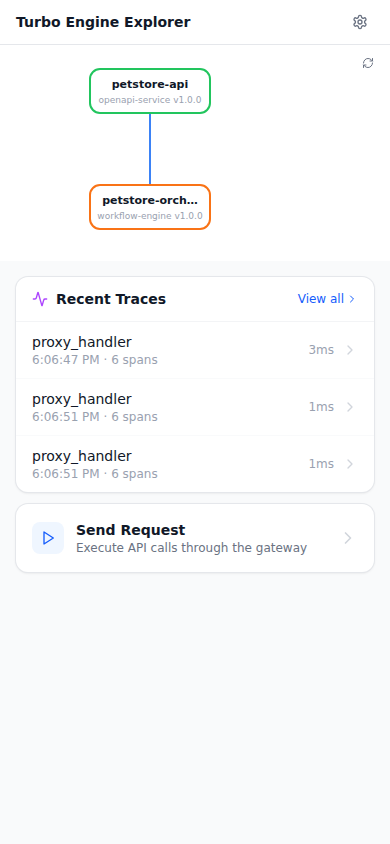

# k8s-e2e — PR #push, Run #34

[View workflow run](https://github.com/lennyburdette/turbo-engine/actions/runs/22261583452)

## Report

# Turbo Engine — K8s E2E Report

> Auto-generated by `hack/scripts/k8s-dump-report.sh`.
> Designed for consumption by Claude Code and human reviewers.

**Generated at:** 2026-02-21T18:07:38Z

---

## 1. Timeline

```
00:00  Waiting for control plane deployments to roll out
00:00  Control plane ready
00:00  Setting up port-forwards
00:07  Port-forwards healthy
00:07  Running scenario: petstore-basic
00:17  Scenario petstore-basic: 14/14 passed
00:17  Tests complete: 16 passed, 0 failed
```

---

## 2. Test Results

**Result: ALL 16 TESTS PASSED**

| Test | Status | Detail | Duration |
|------|--------|--------|----------|
| control-plane-rollout | PASS | All control plane deployments ready | 338ms |
| port-forward-health | PASS | All port-forwards healthy | 42ms |

---

## 3. Pod Status

```
NAME                                                READY   STATUS    RESTARTS   AGE   IP            NODE                             NOMINATED NODE   READINESS GATES
pod/builder-678474bf88-spmbw                        1/1     Running   0          33s   10.244.0.5    turbo-engine-e2e-control-plane   <none>           <none>
pod/console-78fbd5c84-sjv6p                         1/1     Running   0          33s   10.244.0.6    turbo-engine-e2e-control-plane   <none>           <none>
pod/deploy-petstore-api-597d6745fc-5zpfv            1/1     Running   0          10s   10.244.0.14   turbo-engine-e2e-control-plane   <none>           <none>
pod/deploy-petstore-orchestrator-7649c5574d-7wwck   1/1     Running   0          10s   10.244.0.15   turbo-engine-e2e-control-plane   <none>           <none>
pod/envmanager-76c64c8cc9-r585t                     1/1     Running   0          33s   10.244.0.7    turbo-engine-e2e-control-plane   <none>           <none>
pod/explorer-5465b84fd-n4wpg                        1/1     Running   0          33s   10.244.0.8    turbo-engine-e2e-control-plane   <none>           <none>
pod/gateway-586c64fdf5-h8ph6                        1/1     Running   0          33s   10.244.0.9    turbo-engine-e2e-control-plane   <none>           <none>
pod/jaeger-54885dfdf-2b9ts                          1/1     Running   0          33s   10.244.0.10   turbo-engine-e2e-control-plane   <none>           <none>
pod/otel-collector-8584bc4d4c-gmjk4                 1/1     Running   0          33s   10.244.0.11   turbo-engine-e2e-control-plane   <none>           <none>
pod/registry-7d5f66bcd8-srgpn                       1/1     Running   0          33s   10.244.0.12   turbo-engine-e2e-control-plane   <none>           <none>
pod/turbo-engine-operator-7cd95f4bc4-w5mvh          1/1     Running   0          33s   10.244.0.13   turbo-engine-e2e-control-plane   <none>           <none>

NAME                                TYPE        CLUSTER-IP      EXTERNAL-IP   PORT(S)              AGE   SELECTOR
service/builder                     ClusterIP   10.96.133.145   <none>        8082/TCP             33s   app.kubernetes.io/managed-by=kustomize,app.kubernetes.io/name=builder,app.kubernetes.io/part-of=turbo-engine
service/console                     ClusterIP   10.96.21.230    <none>        3000/TCP             33s   app.kubernetes.io/managed-by=kustomize,app.kubernetes.io/name=console,app.kubernetes.io/part-of=turbo-engine
service/envmanager                  ClusterIP   10.96.234.232   <none>        8083/TCP             33s   app.kubernetes.io/managed-by=kustomize,app.kubernetes.io/name=envmanager,app.kubernetes.io/part-of=turbo-engine
service/explorer                    ClusterIP   10.96.83.92     <none>        3001/TCP             33s   app.kubernetes.io/managed-by=kustomize,app.kubernetes.io/name=explorer,app.kubernetes.io/part-of=turbo-engine
service/gateway                     ClusterIP   10.96.243.99    <none>        8080/TCP             33s   app.kubernetes.io/managed-by=kustomize,app.kubernetes.io/name=gateway,app.kubernetes.io/part-of=turbo-engine
service/jaeger                      ClusterIP   10.96.42.208    <none>        16686/TCP,4317/TCP   33s   app.kubernetes.io/managed-by=kustomize,app.kubernetes.io/name=jaeger,app.kubernetes.io/part-of=turbo-engine
service/otel-collector              ClusterIP   10.96.167.144   <none>        4317/TCP,4318/TCP    33s   app.kubernetes.io/managed-by=kustomize,app.kubernetes.io/name=otel-collector,app.kubernetes.io/part-of=turbo-engine
service/registry                    ClusterIP   10.96.252.90    <none>        8081/TCP             33s   app.kubernetes.io/managed-by=kustomize,app.kubernetes.io/name=registry,app.kubernetes.io/part-of=turbo-engine
service/svc-petstore-api            ClusterIP   10.96.126.179   <none>        8080/TCP             10s   app.kubernetes.io/instance=55fec42a7db615d0fc35fcfadaad8255,app.kubernetes.io/name=petstore-api
service/svc-petstore-orchestrator   ClusterIP   10.96.168.162   <none>        8080/TCP             10s   app.kubernetes.io/instance=55fec42a7db615d0fc35fcfadaad8255,app.kubernetes.io/name=petstore-orchestrator
service/turbo-engine-operator       ClusterIP   10.96.130.43    <none>        8084/TCP             33s   app.kubernetes.io/managed-by=kustomize,app.kubernetes.io/name=operator,app.kubernetes.io/part-of=turbo-engine

NAME                                           READY   UP-TO-DATE   AVAILABLE   AGE   CONTAINERS              IMAGES                                        SELECTOR
deployment.apps/builder                        1/1     1            1           33s   builder                 turbo-engine/builder:e2e                      app.kubernetes.io/managed-by=kustomize,app.kubernetes.io/name=builder,app.kubernetes.io/part-of=turbo-engine
deployment.apps/console                        1/1     1            1           33s   console                 turbo-engine/console:e2e                      app.kubernetes.io/managed-by=kustomize,app.kubernetes.io/name=console,app.kubernetes.io/part-of=turbo-engine
deployment.apps/deploy-petstore-api            1/1     1            1           10s   petstore-api            turbo-engine/petstore-mock:e2e                app.kubernetes.io/instance=55fec42a7db615d0fc35fcfadaad8255,app.kubernetes.io/name=petstore-api
deployment.apps/deploy-petstore-orchestrator   1/1     1            1           10s   petstore-orchestrator   turbo-engine/orchestrator:e2e                 app.kubernetes.io/instance=55fec42a7db615d0fc35fcfadaad8255,app.kubernetes.io/name=petstore-orchestrator
deployment.apps/envmanager                     1/1     1            1           33s   envmanager              turbo-engine/envmanager:e2e                   app.kubernetes.io/managed-by=kustomize,app.kubernetes.io/name=envmanager,app.kubernetes.io/part-of=turbo-engine
deployment.apps/explorer                       1/1     1            1           33s   explorer                turbo-engine/explorer:e2e                     app.kubernetes.io/managed-by=kustomize,app.kubernetes.io/name=explorer,app.kubernetes.io/part-of=turbo-engine
deployment.apps/gateway                        1/1     1            1           33s   gateway                 turbo-engine/gateway:e2e                      app.kubernetes.io/managed-by=kustomize,app.kubernetes.io/name=gateway,app.kubernetes.io/part-of=turbo-engine
deployment.apps/jaeger                         1/1     1            1           33s   jaeger                  jaegertracing/all-in-one:1.54                 app.kubernetes.io/managed-by=kustomize,app.kubernetes.io/name=jaeger,app.kubernetes.io/part-of=turbo-engine
deployment.apps/otel-collector                 1/1     1            1           33s   otel-collector          otel/opentelemetry-collector-contrib:0.96.0   app.kubernetes.io/managed-by=kustomize,app.kubernetes.io/name=otel-collector,app.kubernetes.io/part-of=turbo-engine
deployment.apps/registry                       1/1     1            1           33s   registry                turbo-engine/registry:e2e                     app.kubernetes.io/managed-by=kustomize,app.kubernetes.io/name=registry,app.kubernetes.io/part-of=turbo-engine
deployment.apps/turbo-engine-operator          1/1     1            1           33s   operator                turbo-engine/operator:e2e                     app.kubernetes.io/managed-by=kustomize,app.kubernetes.io/name=operator,app.kubernetes.io/part-of=turbo-engine

NAME                                                      DESIRED   CURRENT   READY   AGE   CONTAINERS              IMAGES                                        SELECTOR
replicaset.apps/builder-678474bf88                        1         1         1       33s   builder                 turbo-engine/builder:e2e                      app.kubernetes.io/managed-by=kustomize,app.kubernetes.io/name=builder,app.kubernetes.io/part-of=turbo-engine,pod-template-hash=678474bf88
replicaset.apps/console-78fbd5c84                         1         1         1       33s   console                 turbo-engine/console:e2e                      app.kubernetes.io/managed-by=kustomize,app.kubernetes.io/name=console,app.kubernetes.io/part-of=turbo-engine,pod-template-hash=78fbd5c84
replicaset.apps/deploy-petstore-api-597d6745fc            1         1         1       10s   petstore-api            turbo-engine/petstore-mock:e2e                app.kubernetes.io/instance=55fec42a7db615d0fc35fcfadaad8255,app.kubernetes.io/name=petstore-api,pod-template-hash=597d6745fc
replicaset.apps/deploy-petstore-orchestrator-7649c5574d   1         1         1       10s   petstore-orchestrator   turbo-engine/orchestrator:e2e                 app.kubernetes.io/instance=55fec42a7db615d0fc35fcfadaad8255,app.kubernetes.io/name=petstore-orchestrator,pod-template-hash=7649c5574d
replicaset.apps/envmanager-76c64c8cc9                     1         1         1       33s   envmanager              turbo-engine/envmanager:e2e                   app.kubernetes.io/managed-by=kustomize,app.kubernetes.io/name=envmanager,app.kubernetes.io/part-of=turbo-engine,pod-template-hash=76c64c8cc9
replicaset.apps/explorer-5465b84fd                        1         1         1       33s   explorer                turbo-engine/explorer:e2e                     app.kubernetes.io/managed-by=kustomize,app.kubernetes.io/name=explorer,app.kubernetes.io/part-of=turbo-engine,pod-template-hash=5465b84fd
replicaset.apps/gateway-586c64fdf5                        1         1         1       33s   gateway                 turbo-engine/gateway:e2e                      app.kubernetes.io/managed-by=kustomize,app.kubernetes.io/name=gateway,app.kubernetes.io/part-of=turbo-engine,pod-template-hash=586c64fdf5
replicaset.apps/jaeger-54885dfdf                          1         1         1       33s   jaeger                  jaegertracing/all-in-one:1.54                 app.kubernetes.io/managed-by=kustomize,app.kubernetes.io/name=jaeger,app.kubernetes.io/part-of=turbo-engine,pod-template-hash=54885dfdf
replicaset.apps/otel-collector-8584bc4d4c                 1         1         1       33s   otel-collector          otel/opentelemetry-collector-contrib:0.96.0   app.kubernetes.io/managed-by=kustomize,app.kubernetes.io/name=otel-collector,app.kubernetes.io/part-of=turbo-engine,pod-template-hash=8584bc4d4c
replicaset.apps/registry-7d5f66bcd8                       1         1         1       33s   registry                turbo-engine/registry:e2e                     app.kubernetes.io/managed-by=kustomize,app.kubernetes.io/name=registry,app.kubernetes.io/part-of=turbo-engine,pod-template-hash=7d5f66bcd8
replicaset.apps/turbo-engine-operator-7cd95f4bc4          1         1         1       33s   operator                turbo-engine/operator:e2e                     app.kubernetes.io/managed-by=kustomize,app.kubernetes.io/name=operator,app.kubernetes.io/part-of=turbo-engine,pod-template-hash=7cd95f4bc4
```

---

## 4. Operator Reconciliation Actions

**Total actions:** 18

| Time | Action | Kind | Resource | Details |
|------|--------|------|----------|----------|
| 18:06:41 | reconcile request received |  |  |  |
| 18:06:41 | starting reconciliation |  |  |  |
| 18:06:41 | Create | Deployment | deploy-petstore-api | image=artifact:petstore-api-hash replicas=1 |
| 18:06:41 | Create | Service | svc-petstore-api | selector=petstore-api |
| 18:06:41 | Create | ConfigMap | cm-petstore-api | env_vars=0 |
| 18:06:41 | Create | Deployment | deploy-petstore-orchestrator | image=artifact:petstore-orchestrator-hash replicas=1 |
| 18:06:41 | Create | Service | svc-petstore-orchestrator | selector=petstore-orchestrator |
| 18:06:41 | Create | ConfigMap | cm-petstore-orchestrator | env_vars=1 |
| 18:06:41 | Create | Ingress | localhost-ingress | host=localhost routes=1 tls=false |
| 18:06:41 | Create | Deployment | deploy-petstore-api | image=artifact:petstore-api-hash replicas=1 |
| 18:06:41 | Create | Service | svc-petstore-api | selector=petstore-api |
| 18:06:41 | Create | ConfigMap | cm-petstore-api | env_vars=0 |
| 18:06:41 | Create | Deployment | deploy-petstore-orchestrator | image=artifact:petstore-orchestrator-hash replicas=1 |
| 18:06:41 | Create | Service | svc-petstore-orchestrator | selector=petstore-orchestrator |
| 18:06:41 | Create | ConfigMap | cm-petstore-orchestrator | env_vars=1 |
| 18:06:41 | Create | Ingress | localhost-ingress | host=localhost routes=1 tls=false |
| 18:06:41 | Create |  | localhost-ingress |  |
| 18:06:41 | reconciliation complete |  |  | Running |

---

## 5. Trace Summary

**Captured at:** unknown


[**Open trace viewer →**](./traces.html)

<details><summary>Textual trace summary (for automated analysis)</summary>

```
Trace Summary (captured 2026-02-21T18:07:38Z)
============================================================

builder: 28 traces, 37 spans
  [7f2b977d31bc] builder/builder 0.0ms (1 spans)
  [557b6ac9becb] builder/builder 0.0ms (1 spans)
  [4c1bb0c9f416] builder/builder 0.0ms (1 spans)
  [fe3c2e101133] builder/builder 0.0ms (1 spans)
  [675374b6e543] builder/builder 0.0ms (1 spans)
  [ca677439041e] builder/builder 0.0ms (1 spans)
  [238fa963f089] builder/builder 0.1ms (1 spans)
  [4c0f9ba0be22] builder/builder 0.0ms (1 spans)
  [2384b67d81b0] builder/builder 0.0ms (1 spans)
  [bd796693795d] builder/builder 0.1ms (1 spans)
  [73807110286d] builder/builder 0.3ms (10 spans)
    builder/BuildEngine.Run 0.1ms
    builder/step.resolve 0.0ms
    builder/resolve.execute 0.0ms
    builder/step.compose 0.0ms
    builder/compose.execute 0.0ms
    builder/step.validate 0.0ms
    builder/validate.execute 0.0ms
    builder/step.bundle 0.0ms
    builder/bundle.execute 0.0ms
  [7578326d5914] builder/builder 0.1ms (1 spans)
  [87d2549243b0] builder/builder 0.1ms (1 spans)
  [f69121b14000] builder/builder 0.1ms (1 spans)
  [6027cd271e40] builder/builder 0.0ms (1 spans)
  [6c19a68d7616] builder/builder 0.0ms (1 spans)
  [74832fb5002a] builder/builder 0.0ms (1 spans)
  [8013f1c27e86] builder/builder 0.0ms (1 spans)
  [66546a917319] builder/builder 0.0ms (1 spans)
  [a628684e8acc] builder/builder 0.1ms (1 spans)
  [1702537937a1] builder/builder 0.0ms (1 spans)
  [66f019124e9a] builder/builder 0.5ms (1 spans)
  [5b980e239c83] builder/builder 0.0ms (1 spans)
  [ecc873ceb8a7] builder/builder 0.0ms (1 spans)
  [b419b134b8dc] builder/builder 0.0ms (1 spans)
  [2c11536bf069] builder/builder 0.0ms (1 spans)
  [bba5013141fe] builder/builder 0.1ms (1 spans)
  [2f8ca1019be4] builder/builder 0.1ms (1 spans)

envmanager: 16 traces, 19 spans
  [a3877344b28f] envmanager/envmanager 0.3ms (1 spans)
  [8438be1bf924] envmanager/envmanager 0.0ms (1 spans)
  [9155a6f5d9b9] envmanager/envmanager 0.0ms (1 spans)
  [0b56ed0689bc] envmanager/envmanager 0.0ms (1 spans)
  [abdecadea3e0] envmanager/envmanager 0.1ms (2 spans)
    envmanager/Orchestrator.ListEnvironments 0.0ms
  [6ef85c01bbb4] envmanager/envmanager 0.1ms (2 spans)
    envmanager/Orchestrator.ListEnvironments 0.0ms
  [5e216e6a6e3e] envmanager/envmanager 0.3ms (2 spans)
    envmanager/Orchestrator.CreateEnvironment 0.0ms
  [7eef9bd1e0b6] envmanager/envmanager 0.0ms (1 spans)
  [89bd624043de] envmanager/envmanager 0.0ms (1 spans)
  [c25882c20117] envmanager/envmanager 0.0ms (1 spans)
  [1f92baca0243] envmanager/envmanager 0.0ms (1 spans)
  [b40c6d4fd520] envmanager/envmanager 0.0ms (1 spans)
  [f69d253969e3] envmanager/envmanager 0.0ms (1 spans)
  [fb978345e1d8] envmanager/envmanager 0.0ms (1 spans)
  [fd061c2beb90] envmanager/envmanager 0.1ms (1 spans)
  [f1a9c9a07911] envmanager/envmanager 0.1ms (1 spans)

gateway: 4 traces, 24 spans
  [3ded1c3785ab] gateway/proxy_handler 0.7ms (6 spans)
    gateway/proxy_upstream 0.7ms
    orchestrator/orchestrator 0.4ms
    orchestrator/rpc/getPet 0.4ms
    orchestrator/HTTP GET 0.3ms
    petstore-mock/petstore-mock 0.1ms
  [3faf1d37b19f] gateway/proxy_handler 3.1ms (6 spans)
    gateway/proxy_upstream 3.0ms
    orchestrator/orchestrator 1.8ms
    orchestrator/rpc/listPets 1.6ms
    orchestrator/HTTP GET 1.5ms
    petstore-mock/petstore-mock 0.2ms
  [740c3878461c] gateway/proxy_handler 0.8ms (6 spans)
    gateway/proxy_upstream 0.8ms
    orchestrator/orchestrator 0.5ms
    orchestrator/rpc/listPets 0.4ms
    orchestrator/HTTP GET 0.3ms
    petstore-mock/petstore-mock 0.1ms
  [a0b1c2d3e4f5] gateway/proxy_handler 0.7ms (6 spans)
    gateway/proxy_upstream 0.6ms
    orchestrator/orchestrator 0.4ms
    orchestrator/rpc/listPets 0.4ms
    orchestrator/HTTP GET 0.3ms
    petstore-mock/petstore-mock 0.0ms

operator: no traces
orchestrator: 5 traces, 28 spans
  [ddad673db658] orchestrator/orchestrator 0.7ms (4 spans)
    orchestrator/rpc/listPets 0.6ms
    orchestrator/HTTP GET 0.5ms
    petstore-mock/petstore-mock 0.1ms
  [3ded1c3785ab] gateway/proxy_handler 0.7ms (6 spans)
    gateway/proxy_upstream 0.7ms
    orchestrator/orchestrator 0.4ms
    orchestrator/rpc/getPet 0.4ms
    orchestrator/HTTP GET 0.3ms
    petstore-mock/petstore-mock 0.1ms
  [3faf1d37b19f] gateway/proxy_handler 3.1ms (6 spans)
    gateway/proxy_upstream 3.0ms
    orchestrator/orchestrator 1.8ms
    orchestrator/rpc/listPets 1.6ms
    orchestrator/HTTP GET 1.5ms
    petstore-mock/petstore-mock 0.2ms
  [740c3878461c] gateway/proxy_handler 0.8ms (6 spans)
    gateway/proxy_upstream 0.8ms
    orchestrator/orchestrator 0.5ms
    orchestrator/rpc/listPets 0.4ms
    orchestrator/HTTP GET 0.3ms
    petstore-mock/petstore-mock 0.1ms
  [a0b1c2d3e4f5] gateway/proxy_handler 0.7ms (6 spans)
    gateway/proxy_upstream 0.6ms
    orchestrator/orchestrator 0.4ms
    orchestrator/rpc/listPets 0.4ms
    orchestrator/HTTP GET 0.3ms
    petstore-mock/petstore-mock 0.0ms

petstore-mock: 6 traces, 29 spans
  [3ded1c3785ab] gateway/proxy_handler 0.7ms (6 spans)
    gateway/proxy_upstream 0.7ms
    orchestrator/orchestrator 0.4ms
    orchestrator/rpc/getPet 0.4ms
    orchestrator/HTTP GET 0.3ms
    petstore-mock/petstore-mock 0.1ms
  [3faf1d37b19f] gateway/proxy_handler 3.1ms (6 spans)
    gateway/proxy_upstream 3.0ms
    orchestrator/orchestrator 1.8ms
    orchestrator/rpc/listPets 1.6ms
    orchestrator/HTTP GET 1.5ms
    petstore-mock/petstore-mock 0.2ms
  [740c3878461c] gateway/proxy_handler 0.8ms (6 spans)
    gateway/proxy_upstream 0.8ms
    orchestrator/orchestrator 0.5ms
    orchestrator/rpc/listPets 0.4ms
    orchestrator/HTTP GET 0.3ms
    petstore-mock/petstore-mock 0.1ms
  [a0b1c2d3e4f5] gateway/proxy_handler 0.7ms (6 spans)
    gateway/proxy_upstream 0.6ms
    orchestrator/orchestrator 0.4ms
    orchestrator/rpc/listPets 0.4ms
    orchestrator/HTTP GET 0.3ms
    petstore-mock/petstore-mock 0.0ms
  [02b6835f9703] petstore-mock/petstore-mock 0.1ms (1 spans)
  [ddad673db658] orchestrator/orchestrator 0.7ms (4 spans)
    orchestrator/rpc/listPets 0.6ms
    orchestrator/HTTP GET 0.5ms
    petstore-mock/petstore-mock 0.1ms

registry: 5 traces, 5 spans
  [29fd54b9d676] registry/ListPackages 0.1ms (1 spans)
  [dc514512d712] registry/PublishPackage 0.2ms (1 spans)
  [28bc56c1cacc] registry/ListPackages 0.1ms (1 spans)
  [50b1da3d27d0] registry/ListPackages 0.3ms (1 spans)
  [9b17aa97b179] registry/PublishPackage 0.1ms (1 spans)

Total: 64 traces, 142 spans across 7 services
```

</details>

_Full trace data: `ci-report/traces.json` (168182 bytes)_

---

## 6. Screenshots

| Page | File | Size |
|------|------|------|
| dashboard | `ci-report/screenshots/dashboard.png` | 53178 bytes |
| environments | `ci-report/screenshots/environments.png` | 37579 bytes |
| explorer | `ci-report/screenshots/explorer.png` | 34741 bytes |
| packages | `ci-report/screenshots/packages.png` | 43272 bytes |

---

## 7. Service Logs (last 200 lines each)

### registry

```
{"time":"2026-02-21T18:06:19.482878444Z","level":"INFO","msg":"starting registry service","port":"8081"}
{"time":"2026-02-21T18:06:41.866921493Z","level":"INFO","msg":"published package","id":"pkg_1","name":"petstore-api","version":"1.0.0"}
{"time":"2026-02-21T18:06:41.870314783Z","level":"INFO","msg":"published package","id":"pkg_2","name":"petstore-orchestrator","version":"1.0.0"}
```

### builder

```
{"time":"2026-02-21T18:06:19.077551196Z","level":"INFO","msg":"builder service starting","port":"8082"}
{"time":"2026-02-21T18:06:41.878276706Z","level":"INFO","msg":"build created","build_id":"bld-1771697201878-1","environment_id":"55fec42a7db615d0fc35fcfadaad8255"}
{"time":"2026-02-21T18:06:41.878489571Z","level":"INFO","msg":"build completed successfully","build_id":"bld-1771697201878-1"}
```

### envmanager

```
{"time":"2026-02-21T18:06:19.212408024Z","level":"INFO","msg":"starting server","addr":":8083"}
{"time":"2026-02-21T18:06:41.874037949Z","level":"INFO","msg":"environment created","id":"55fec42a7db615d0fc35fcfadaad8255","name":"petstore-e2e"}
```

### turbo-engine-operator

```
{"time":"2026-02-21T18:06:19.670506271Z","level":"INFO","msg":"starting operator service","version":"0.1.0","log_level":"debug"}
{"time":"2026-02-21T18:06:19.670664146Z","level":"WARN","msg":"failed to initialize tracer, continuing without tracing","error":"creating resource: conflicting Schema URL: https://opentelemetry.io/schemas/1.26.0 and https://opentelemetry.io/schemas/1.24.0"}
{"time":"2026-02-21T18:06:19.670689284Z","level":"INFO","msg":"operator mode: k8s — will create real Kubernetes resources"}
{"time":"2026-02-21T18:06:19.672161828Z","level":"INFO","msg":"starting builder poll loop","component":"poller","builder_url":"http://builder:8082","interval":5000000000}
{"time":"2026-02-21T18:06:19.672229635Z","level":"INFO","msg":"listening","addr":":8084"}
{"time":"2026-02-21T18:06:24.673401101Z","level":"DEBUG","msg":"failed to poll builder (will retry)","component":"poller","builder_url":"http://builder:8082","error":"Get \"http://builder:8082/v1/graphs\": dial tcp 10.96.133.145:8082: connect: connection refused"}
{"time":"2026-02-21T18:06:29.677461615Z","level":"DEBUG","msg":"failed to poll builder (will retry)","component":"poller","builder_url":"http://builder:8082","error":"Get \"http://builder:8082/v1/graphs\": dial tcp 10.96.133.145:8082: connect: connection refused"}
{"time":"2026-02-21T18:06:34.673688061Z","level":"WARN","msg":"builder returned non-200 status","component":"poller","builder_url":"http://builder:8082","status":404}
{"time":"2026-02-21T18:06:39.674037307Z","level":"WARN","msg":"builder returned non-200 status","component":"poller","builder_url":"http://builder:8082","status":404}
{"time":"2026-02-21T18:06:41.886345991Z","level":"INFO","msg":"reconcile request received","component":"handler","environment_id":"55fec42a7db615d0fc35fcfadaad8255","build_id":"bld-1771697201878-1"}
{"time":"2026-02-21T18:06:41.886381538Z","level":"INFO","msg":"starting reconciliation","component":"reconciler","environment_id":"55fec42a7db615d0fc35fcfadaad8255","build_id":"bld-1771697201878-1","components":2}
{"time":"2026-02-21T18:06:41.886405593Z","level":"INFO","msg":"reconciliation action","component":"reconciler","environment_id":"55fec42a7db615d0fc35fcfadaad8255","action":"Create","resource_kind":"Deployment","resource_name":"deploy-petstore-api","details":"image=artifact:petstore-api-hash replicas=1"}
{"time":"2026-02-21T18:06:41.886426452Z","level":"INFO","msg":"reconciliation action","component":"reconciler","environment_id":"55fec42a7db615d0fc35fcfadaad8255","action":"Create","resource_kind":"Service","resource_name":"svc-petstore-api","details":"selector=petstore-api"}
{"time":"2026-02-21T18:06:41.886432974Z","level":"INFO","msg":"reconciliation action","component":"reconciler","environment_id":"55fec42a7db615d0fc35fcfadaad8255","action":"Create","resource_kind":"ConfigMap","resource_name":"cm-petstore-api","details":"env_vars=0"}
{"time":"2026-02-21T18:06:41.886437834Z","level":"INFO","msg":"reconciliation action","component":"reconciler","environment_id":"55fec42a7db615d0fc35fcfadaad8255","action":"Create","resource_kind":"Deployment","resource_name":"deploy-petstore-orchestrator","details":"image=artifact:petstore-orchestrator-hash replicas=1"}
{"time":"2026-02-21T18:06:41.886442712Z","level":"INFO","msg":"reconciliation action","component":"reconciler","environment_id":"55fec42a7db615d0fc35fcfadaad8255","action":"Create","resource_kind":"Service","resource_name":"svc-petstore-orchestrator","details":"selector=petstore-orchestrator"}
{"time":"2026-02-21T18:06:41.886447542Z","level":"INFO","msg":"reconciliation action","component":"reconciler","environment_id":"55fec42a7db615d0fc35fcfadaad8255","action":"Create","resource_kind":"ConfigMap","resource_name":"cm-petstore-orchestrator","details":"env_vars=1"}
{"time":"2026-02-21T18:06:41.886452661Z","level":"INFO","msg":"reconciliation action","component":"reconciler","environment_id":"55fec42a7db615d0fc35fcfadaad8255","action":"Create","resource_kind":"Ingress","resource_name":"localhost-ingress","details":"host=localhost routes=1 tls=false"}
{"time":"2026-02-21T18:06:41.886459374Z","level":"INFO","msg":"applying action","component":"k8s-applier","type":"Create","kind":"Deployment","name":"deploy-petstore-api","details":"image=artifact:petstore-api-hash replicas=1"}
{"time":"2026-02-21T18:06:41.903918843Z","level":"INFO","msg":"applying action","component":"k8s-applier","type":"Create","kind":"Service","name":"svc-petstore-api","details":"selector=petstore-api"}
{"time":"2026-02-21T18:06:41.918319858Z","level":"INFO","msg":"applying action","component":"k8s-applier","type":"Create","kind":"ConfigMap","name":"cm-petstore-api","details":"env_vars=0"}
{"time":"2026-02-21T18:06:41.924725856Z","level":"INFO","msg":"applying action","component":"k8s-applier","type":"Create","kind":"Deployment","name":"deploy-petstore-orchestrator","details":"image=artifact:petstore-orchestrator-hash replicas=1"}
{"time":"2026-02-21T18:06:41.930987346Z","level":"INFO","msg":"applying action","component":"k8s-applier","type":"Create","kind":"Service","name":"svc-petstore-orchestrator","details":"selector=petstore-orchestrator"}
{"time":"2026-02-21T18:06:41.945206572Z","level":"INFO","msg":"applying action","component":"k8s-applier","type":"Create","kind":"ConfigMap","name":"cm-petstore-orchestrator","details":"env_vars=1"}
{"time":"2026-02-21T18:06:41.951535842Z","level":"INFO","msg":"applying action","component":"k8s-applier","type":"Create","kind":"Ingress","name":"localhost-ingress","details":"host=localhost routes=1 tls=false"}
{"time":"2026-02-21T18:06:41.951563874Z","level":"INFO","msg":"ingress action handled via gateway-config endpoint","component":"k8s-applier","type":"Create","name":"localhost-ingress"}
{"time":"2026-02-21T18:06:41.951582739Z","level":"INFO","msg":"reconciliation complete","component":"reconciler","environment_id":"55fec42a7db615d0fc35fcfadaad8255","phase":"Running","actions":7}
{"time":"2026-02-21T18:06:42.518828577Z","level":"INFO","msg":"gateway config request","component":"handler","routes":1}
{"time":"2026-02-21T18:06:44.674981184Z","level":"WARN","msg":"builder returned non-200 status","component":"poller","builder_url":"http://builder:8082","status":404}
{"time":"2026-02-21T18:06:49.6745311Z","level":"WARN","msg":"builder returned non-200 status","component":"poller","builder_url":"http://builder:8082","status":404}
```

### gateway

```
2026-02-21T18:06:19.241565Z  INFO gateway: starting gateway port=8080 config_url=Some("http://turbo-engine-operator:8084/v1/gateway-config")
2026-02-21T18:06:19.595906Z  WARN gateway: config not available yet, retrying err=upstream unavailable: error sending request for url (http://turbo-engine-operator:8084/v1/gateway-config) attempt=1 max_attempts=4
2026-02-21T18:06:20.799015Z  WARN gateway: config not available yet, retrying err=upstream unavailable: error sending request for url (http://turbo-engine-operator:8084/v1/gateway-config) attempt=2 max_attempts=4
2026-02-21T18:06:23.009263Z  WARN gateway: config not available yet, retrying err=upstream unavailable: error sending request for url (http://turbo-engine-operator:8084/v1/gateway-config) attempt=3 max_attempts=4
2026-02-21T18:06:27.212258Z  WARN gateway: failed to load config after retries — starting with empty routing table err=upstream unavailable: error sending request for url (http://turbo-engine-operator:8084/v1/gateway-config)
2026-02-21T18:06:27.417409Z  INFO gateway: gateway listening addr=0.0.0.0:8080
2026-02-21T18:06:42.519617Z  INFO gateway::config: config reloaded routes=1
```

### console

```
/docker-entrypoint.sh: /docker-entrypoint.d/ is not empty, will attempt to perform configuration
/docker-entrypoint.sh: Looking for shell scripts in /docker-entrypoint.d/
/docker-entrypoint.sh: Launching /docker-entrypoint.d/10-listen-on-ipv6-by-default.sh
10-listen-on-ipv6-by-default.sh: info: Getting the checksum of /etc/nginx/conf.d/default.conf
10-listen-on-ipv6-by-default.sh: info: /etc/nginx/conf.d/default.conf differs from the packaged version
/docker-entrypoint.sh: Sourcing /docker-entrypoint.d/15-local-resolvers.envsh
/docker-entrypoint.sh: Launching /docker-entrypoint.d/20-envsubst-on-templates.sh
/docker-entrypoint.sh: Launching /docker-entrypoint.d/30-tune-worker-processes.sh
/docker-entrypoint.sh: Configuration complete; ready for start up
2026/02/21 18:06:19 [notice] 1#1: using the "epoll" event method
2026/02/21 18:06:19 [notice] 1#1: nginx/1.27.5
2026/02/21 18:06:19 [notice] 1#1: built by gcc 14.2.0 (Alpine 14.2.0) 
2026/02/21 18:06:19 [notice] 1#1: OS: Linux 6.11.0-1018-azure
2026/02/21 18:06:19 [notice] 1#1: getrlimit(RLIMIT_NOFILE): 1048576:1048576
2026/02/21 18:06:19 [notice] 1#1: start worker processes
2026/02/21 18:06:19 [notice] 1#1: start worker process 37
2026/02/21 18:06:19 [notice] 1#1: start worker process 38
2026/02/21 18:06:19 [notice] 1#1: start worker process 39
2026/02/21 18:06:19 [notice] 1#1: start worker process 40
10.244.0.1 - - [21/Feb/2026:18:06:31 +0000] "GET / HTTP/1.1" 200 635 "-" "kube-probe/1.35" "-"
10.244.0.1 - - [21/Feb/2026:18:06:33 +0000] "GET / HTTP/1.1" 200 635 "-" "kube-probe/1.35" "-"
10.244.0.1 - - [21/Feb/2026:18:06:41 +0000] "GET / HTTP/1.1" 200 635 "-" "kube-probe/1.35" "-"
10.244.0.1 - - [21/Feb/2026:18:06:48 +0000] "GET / HTTP/1.1" 200 635 "-" "kube-probe/1.35" "-"
10.244.0.1 - - [21/Feb/2026:18:06:51 +0000] "GET / HTTP/1.1" 200 635 "-" "kube-probe/1.35" "-"
```

### Operator-deployed components

#### petstore-basic-petstore-api

```
{"level":"info","msg":"petstore mock starting","port":"8080","time":"2026-02-21T18:06:42.447366014Z"}
{"level":"info","method":"GET","msg":"request received","path":"/pets","query":"","time":"2026-02-21T18:06:47.538022583Z","trace_id":"3faf1d37b19f9546f5b5f809d026a8f8","traceparent":"00-3faf1d37b19f9546f5b5f809d026a8f8-2760f0ed1a90de6a-01","x_request_id":""}
{"duration_ms":0,"level":"info","method":"GET","msg":"response sent","path":"/pets","status":200,"time":"2026-02-21T18:06:47.538168666Z","trace_id":"3faf1d37b19f9546f5b5f809d026a8f8"}
{"level":"info","method":"GET","msg":"request received","path":"/pets","query":"","time":"2026-02-21T18:06:49.543473479Z","trace_id":"","traceparent":"","x_request_id":""}
{"duration_ms":0,"level":"info","method":"GET","msg":"response sent","path":"/pets","status":200,"time":"2026-02-21T18:06:49.543518313Z","trace_id":""}
{"level":"info","method":"GET","msg":"request received","path":"/pets","query":"","time":"2026-02-21T18:06:51.549076659Z","trace_id":"ddad673db6580158f8f1ab1357dfd266","traceparent":"00-ddad673db6580158f8f1ab1357dfd266-04a77ef78f2ec4b9-01","x_request_id":""}
{"duration_ms":0,"level":"info","method":"GET","msg":"response sent","path":"/pets","status":200,"time":"2026-02-21T18:06:51.549129548Z","trace_id":"ddad673db6580158f8f1ab1357dfd266"}
{"level":"info","method":"GET","msg":"request received","path":"/pets","query":"","time":"2026-02-21T18:06:51.552852895Z","trace_id":"740c3878461c382bee77b67237ae6aff","traceparent":"00-740c3878461c382bee77b67237ae6aff-a250051a6a42b544-01","x_request_id":""}
{"duration_ms":0,"level":"info","method":"GET","msg":"response sent","path":"/pets","status":200,"time":"2026-02-21T18:06:51.552880968Z","trace_id":"740c3878461c382bee77b67237ae6aff"}
{"level":"info","method":"GET","msg":"request received","path":"/pets/2","query":"","time":"2026-02-21T18:06:51.556503037Z","trace_id":"3ded1c3785ab151044bd66c8d1c1b440","traceparent":"00-3ded1c3785ab151044bd66c8d1c1b440-4a14be484ac54b25-01","x_request_id":""}
{"duration_ms":0,"level":"info","method":"GET","msg":"response sent","path":"/pets/2","status":200,"time":"2026-02-21T18:06:51.556542281Z","trace_id":"3ded1c3785ab151044bd66c8d1c1b440"}
{"level":"info","method":"GET","msg":"request received","path":"/pets","query":"","time":"2026-02-21T18:06:51.560369004Z","trace_id":"a0b1c2d3e4f5a6b7c8d9e0f1a2b3c4d5","traceparent":"00-a0b1c2d3e4f5a6b7c8d9e0f1a2b3c4d5-b1808f8ccc5f8782-01","x_request_id":""}
{"duration_ms":0,"level":"info","method":"GET","msg":"response sent","path":"/pets","status":200,"time":"2026-02-21T18:06:51.560396936Z","trace_id":"a0b1c2d3e4f5a6b7c8d9e0f1a2b3c4d5"}```

#### petstore-basic-petstore-orchestrator

```
{"level":"info","msg":"orchestrator starting","port":"8080","time":"2026-02-21T18:06:42.477352042Z","upstream_url":"http://svc-petstore-api:8080"}
{"level":"info","method":"POST","msg":"request received","path":"/rpc/listPets","query":"","time":"2026-02-21T18:06:47.536756929Z","trace_id":"3faf1d37b19f9546f5b5f809d026a8f8","traceparent":"00-3faf1d37b19f9546f5b5f809d026a8f8-b22cdcf7f5a3cbec-01","x_request_id":"e3148ac0-3fba-4e15-a945-bd0156f0177d"}
{"level":"info","method":"GET","msg":"upstream call start","rpc":"listPets","time":"2026-02-21T18:06:47.536865462Z","trace_id":"3faf1d37b19f9546f5b5f809d026a8f8","url":"http://svc-petstore-api:8080/pets"}
{"duration_ms":1,"level":"info","msg":"upstream call complete","response_bytes":240,"rpc":"listPets","time":"2026-02-21T18:06:47.538419195Z","trace_id":"3faf1d37b19f9546f5b5f809d026a8f8","upstream_status":200,"url":"http://svc-petstore-api:8080/pets"}
{"duration_ms":1,"level":"info","method":"POST","msg":"response sent","path":"/rpc/listPets","status":200,"time":"2026-02-21T18:06:47.538499345Z","trace_id":"3faf1d37b19f9546f5b5f809d026a8f8"}
{"level":"info","method":"POST","msg":"request received","path":"/rpc/listPets","query":"","time":"2026-02-21T18:06:51.548716573Z","trace_id":"","traceparent":"","x_request_id":""}
{"level":"info","method":"GET","msg":"upstream call start","rpc":"listPets","time":"2026-02-21T18:06:51.548776455Z","trace_id":"","url":"http://svc-petstore-api:8080/pets"}
{"duration_ms":0,"level":"info","msg":"upstream call complete","response_bytes":240,"rpc":"listPets","time":"2026-02-21T18:06:51.549315053Z","trace_id":"","upstream_status":200,"url":"http://svc-petstore-api:8080/pets"}
{"duration_ms":0,"level":"info","method":"POST","msg":"response sent","path":"/rpc/listPets","status":200,"time":"2026-02-21T18:06:51.549410091Z","trace_id":""}
{"level":"info","method":"POST","msg":"request received","path":"/rpc/listPets","query":"","time":"2026-02-21T18:06:51.552647208Z","trace_id":"740c3878461c382bee77b67237ae6aff","traceparent":"00-740c3878461c382bee77b67237ae6aff-a6f10955086f424f-01","x_request_id":"5ced6b4d-844a-4f44-97d9-3223102e5bdc"}
{"level":"info","method":"GET","msg":"upstream call start","rpc":"listPets","time":"2026-02-21T18:06:51.552673327Z","trace_id":"740c3878461c382bee77b67237ae6aff","url":"http://svc-petstore-api:8080/pets"}
{"duration_ms":0,"level":"info","msg":"upstream call complete","response_bytes":240,"rpc":"listPets","time":"2026-02-21T18:06:51.553031311Z","trace_id":"740c3878461c382bee77b67237ae6aff","upstream_status":200,"url":"http://svc-petstore-api:8080/pets"}
{"duration_ms":0,"level":"info","method":"POST","msg":"response sent","path":"/rpc/listPets","status":200,"time":"2026-02-21T18:06:51.553102685Z","trace_id":"740c3878461c382bee77b67237ae6aff"}
{"level":"info","method":"POST","msg":"request received","path":"/rpc/getPet","query":"id=2","time":"2026-02-21T18:06:51.556297941Z","trace_id":"3ded1c3785ab151044bd66c8d1c1b440","traceparent":"00-3ded1c3785ab151044bd66c8d1c1b440-658d995cb3143020-01","x_request_id":"58cf510f-4d50-4372-8b6a-a4fe99007b03"}
{"level":"info","method":"GET","msg":"upstream call start","rpc":"getPet","time":"2026-02-21T18:06:51.556322427Z","trace_id":"3ded1c3785ab151044bd66c8d1c1b440","url":"http://svc-petstore-api:8080/pets/2"}
{"duration_ms":0,"level":"info","msg":"upstream call complete","response_bytes":118,"rpc":"getPet","time":"2026-02-21T18:06:51.556670361Z","trace_id":"3ded1c3785ab151044bd66c8d1c1b440","upstream_status":200,"url":"http://svc-petstore-api:8080/pets/2"}
{"duration_ms":0,"level":"info","method":"POST","msg":"response sent","path":"/rpc/getPet","status":200,"time":"2026-02-21T18:06:51.556714533Z","trace_id":"3ded1c3785ab151044bd66c8d1c1b440"}
{"level":"info","method":"POST","msg":"request received","path":"/rpc/listPets","query":"","time":"2026-02-21T18:06:51.560200328Z","trace_id":"a0b1c2d3e4f5a6b7c8d9e0f1a2b3c4d5","traceparent":"00-a0b1c2d3e4f5a6b7c8d9e0f1a2b3c4d5-0b1122285166c37c-01","x_request_id":"1628c6c0-38fe-4ada-a9f7-486da3b4f96b"}
{"level":"info","method":"GET","msg":"upstream call start","rpc":"listPets","time":"2026-02-21T18:06:51.560223732Z","trace_id":"a0b1c2d3e4f5a6b7c8d9e0f1a2b3c4d5","url":"http://svc-petstore-api:8080/pets"}
{"duration_ms":0,"level":"info","msg":"upstream call complete","response_bytes":240,"rpc":"listPets","time":"2026-02-21T18:06:51.560534183Z","trace_id":"a0b1c2d3e4f5a6b7c8d9e0f1a2b3c4d5","upstream_status":200,"url":"http://svc-petstore-api:8080/pets"}
{"duration_ms":0,"level":"info","method":"POST","msg":"response sent","path":"/rpc/listPets","status":200,"time":"2026-02-21T18:06:51.560590669Z","trace_id":"a0b1c2d3e4f5a6b7c8d9e0f1a2b3c4d5"}```

---

## 8. Errors and Warnings

Scanning logs for errors, panics, and warnings...

### turbo-engine-operator

```
{"time":"2026-02-21T18:06:19.670664146Z","level":"WARN","msg":"failed to initialize tracer, continuing without tracing","error":"creating resource: conflicting Schema URL: https://opentelemetry.io/schemas/1.26.0 and https://opentelemetry.io/schemas/1.24.0"}
{"time":"2026-02-21T18:06:34.673688061Z","level":"WARN","msg":"builder returned non-200 status","component":"poller","builder_url":"http://builder:8082","status":404}
{"time":"2026-02-21T18:06:39.674037307Z","level":"WARN","msg":"builder returned non-200 status","component":"poller","builder_url":"http://builder:8082","status":404}
{"time":"2026-02-21T18:06:44.674981184Z","level":"WARN","msg":"builder returned non-200 status","component":"poller","builder_url":"http://builder:8082","status":404}
{"time":"2026-02-21T18:06:49.6745311Z","level":"WARN","msg":"builder returned non-200 status","component":"poller","builder_url":"http://builder:8082","status":404}
```

---

## 9. Kubernetes Events

```
LAST SEEN   TYPE     REASON              OBJECT                                               MESSAGE
34s         Normal   Created             pod/envmanager-76c64c8cc9-r585t                      Container created
34s         Normal   ScalingReplicaSet   deployment/gateway                                   Scaled up replica set gateway-586c64fdf5 from 0 to 1
34s         Normal   Created             pod/builder-678474bf88-spmbw                         Container created
34s         Normal   ScalingReplicaSet   deployment/otel-collector                            Scaled up replica set otel-collector-8584bc4d4c from 0 to 1
34s         Normal   SuccessfulCreate    replicaset/builder-678474bf88                        Created pod: builder-678474bf88-spmbw
34s         Normal   ScalingReplicaSet   deployment/builder                                   Scaled up replica set builder-678474bf88 from 0 to 1
34s         Normal   Scheduled           pod/console-78fbd5c84-sjv6p                          Successfully assigned turbo-engine-e2e/console-78fbd5c84-sjv6p to turbo-engine-e2e-control-plane
34s         Normal   Pulled              pod/console-78fbd5c84-sjv6p                          Container image "turbo-engine/console:e2e" already present on machine and can be accessed by the pod
34s         Normal   Created             pod/console-78fbd5c84-sjv6p                          Container created
34s         Normal   Scheduled           pod/builder-678474bf88-spmbw                         Successfully assigned turbo-engine-e2e/builder-678474bf88-spmbw to turbo-engine-e2e-control-plane
34s         Normal   SuccessfulCreate    replicaset/console-78fbd5c84                         Created pod: console-78fbd5c84-sjv6p
34s         Normal   ScalingReplicaSet   deployment/console                                   Scaled up replica set console-78fbd5c84 from 0 to 1
34s         Normal   ScalingReplicaSet   deployment/turbo-engine-operator                     Scaled up replica set turbo-engine-operator-7cd95f4bc4 from 0 to 1
34s         Normal   SuccessfulCreate    replicaset/turbo-engine-operator-7cd95f4bc4          Created pod: turbo-engine-operator-7cd95f4bc4-w5mvh
34s         Normal   Scheduled           pod/otel-collector-8584bc4d4c-gmjk4                  Successfully assigned turbo-engine-e2e/otel-collector-8584bc4d4c-gmjk4 to turbo-engine-e2e-control-plane
34s         Normal   ScalingReplicaSet   deployment/jaeger                                    Scaled up replica set jaeger-54885dfdf from 0 to 1
34s         Normal   Scheduled           pod/jaeger-54885dfdf-2b9ts                           Successfully assigned turbo-engine-e2e/jaeger-54885dfdf-2b9ts to turbo-engine-e2e-control-plane
34s         Normal   Scheduled           pod/turbo-engine-operator-7cd95f4bc4-w5mvh           Successfully assigned turbo-engine-e2e/turbo-engine-operator-7cd95f4bc4-w5mvh to turbo-engine-e2e-control-plane
34s         Normal   ScalingReplicaSet   deployment/registry                                  Scaled up replica set registry-7d5f66bcd8 from 0 to 1
34s         Normal   SuccessfulCreate    replicaset/registry-7d5f66bcd8                       Created pod: registry-7d5f66bcd8-srgpn
34s         Normal   SuccessfulCreate    replicaset/otel-collector-8584bc4d4c                 Created pod: otel-collector-8584bc4d4c-gmjk4
34s         Normal   SuccessfulCreate    replicaset/envmanager-76c64c8cc9                     Created pod: envmanager-76c64c8cc9-r585t
34s         Normal   SuccessfulCreate    replicaset/gateway-586c64fdf5                        Created pod: gateway-586c64fdf5-h8ph6
34s         Normal   Scheduled           pod/registry-7d5f66bcd8-srgpn                        Successfully assigned turbo-engine-e2e/registry-7d5f66bcd8-srgpn to turbo-engine-e2e-control-plane
34s         Normal   Scheduled           pod/envmanager-76c64c8cc9-r585t                      Successfully assigned turbo-engine-e2e/envmanager-76c64c8cc9-r585t to turbo-engine-e2e-control-plane
34s         Normal   Pulled              pod/envmanager-76c64c8cc9-r585t                      Container image "turbo-engine/envmanager:e2e" already present on machine and can be accessed by the pod
34s         Normal   Pulled              pod/builder-678474bf88-spmbw                         Container image "turbo-engine/builder:e2e" already present on machine and can be accessed by the pod
34s         Normal   SuccessfulCreate    replicaset/jaeger-54885dfdf                          Created pod: jaeger-54885dfdf-2b9ts
34s         Normal   Created             pod/gateway-586c64fdf5-h8ph6                         Container created
34s         Normal   ScalingReplicaSet   deployment/envmanager                                Scaled up replica set envmanager-76c64c8cc9 from 0 to 1
34s         Normal   Scheduled           pod/explorer-5465b84fd-n4wpg                         Successfully assigned turbo-engine-e2e/explorer-5465b84fd-n4wpg to turbo-engine-e2e-control-plane
34s         Normal   Pulled              pod/gateway-586c64fdf5-h8ph6                         Container image "turbo-engine/gateway:e2e" already present on machine and can be accessed by the pod
34s         Normal   Scheduled           pod/gateway-586c64fdf5-h8ph6                         Successfully assigned turbo-engine-e2e/gateway-586c64fdf5-h8ph6 to turbo-engine-e2e-control-plane
34s         Normal   ScalingReplicaSet   deployment/explorer                                  Scaled up replica set explorer-5465b84fd from 0 to 1
34s         Normal   SuccessfulCreate    replicaset/explorer-5465b84fd                        Created pod: explorer-5465b84fd-n4wpg
33s         Normal   Started             pod/envmanager-76c64c8cc9-r585t                      Container started
33s         Normal   Created             pod/turbo-engine-operator-7cd95f4bc4-w5mvh           Container created
33s         Normal   Pulling             pod/jaeger-54885dfdf-2b9ts                           Pulling image "jaegertracing/all-in-one:1.54"
33s         Normal   Created             pod/registry-7d5f66bcd8-srgpn                        Container created
33s         Normal   Started             pod/gateway-586c64fdf5-h8ph6                         Container started
33s         Normal   Pulled              pod/registry-7d5f66bcd8-srgpn                        Container image "turbo-engine/registry:e2e" already present on machine and can be accessed by the pod
33s         Normal   Started             pod/registry-7d5f66bcd8-srgpn                        Container started
33s         Normal   Started             pod/explorer-5465b84fd-n4wpg                         Container started
33s         Normal   Created             pod/explorer-5465b84fd-n4wpg                         Container created
33s         Normal   Started             pod/builder-678474bf88-spmbw                         Container started
33s         Normal   Pulled              pod/explorer-5465b84fd-n4wpg                         Container image "turbo-engine/explorer:e2e" already present on machine and can be accessed by the pod
33s         Normal   Started             pod/console-78fbd5c84-sjv6p                          Container started
33s         Normal   Pulled              pod/turbo-engine-operator-7cd95f4bc4-w5mvh           Container image "turbo-engine/operator:e2e" already present on machine and can be accessed by the pod
33s         Normal   Pulling             pod/otel-collector-8584bc4d4c-gmjk4                  Pulling image "otel/opentelemetry-collector-contrib:0.96.0"
33s         Normal   Started             pod/turbo-engine-operator-7cd95f4bc4-w5mvh           Container started
32s         Normal   Pulled              pod/jaeger-54885dfdf-2b9ts                           Successfully pulled image "jaegertracing/all-in-one:1.54" in 1.425s (1.425s including waiting). Image size: 33344095 bytes.
32s         Normal   Started             pod/jaeger-54885dfdf-2b9ts                           Container started
32s         Normal   Created             pod/jaeger-54885dfdf-2b9ts                           Container created
30s         Normal   Pulled              pod/otel-collector-8584bc4d4c-gmjk4                  Successfully pulled image "otel/opentelemetry-collector-contrib:0.96.0" in 1.921s (3.25s including waiting). Image size: 65128183 bytes.
30s         Normal   Started             pod/otel-collector-8584bc4d4c-gmjk4                  Container started
30s         Normal   Created             pod/otel-collector-8584bc4d4c-gmjk4                  Container created
11s         Normal   SuccessfulCreate    replicaset/deploy-petstore-api-597d6745fc            Created pod: deploy-petstore-api-597d6745fc-5zpfv
11s         Normal   SuccessfulCreate    replicaset/deploy-petstore-orchestrator-7649c5574d   Created pod: deploy-petstore-orchestrator-7649c5574d-7wwck
11s         Normal   Scheduled           pod/deploy-petstore-orchestrator-7649c5574d-7wwck    Successfully assigned turbo-engine-e2e/deploy-petstore-orchestrator-7649c5574d-7wwck to turbo-engine-e2e-control-plane
11s         Normal   ScalingReplicaSet   deployment/deploy-petstore-api                       Scaled up replica set deploy-petstore-api-597d6745fc from 0 to 1
11s         Normal   ScalingReplicaSet   deployment/deploy-petstore-orchestrator              Scaled up replica set deploy-petstore-orchestrator-7649c5574d from 0 to 1
11s         Normal   Scheduled           pod/deploy-petstore-api-597d6745fc-5zpfv             Successfully assigned turbo-engine-e2e/deploy-petstore-api-597d6745fc-5zpfv to turbo-engine-e2e-control-plane
10s         Normal   Started             pod/deploy-petstore-orchestrator-7649c5574d-7wwck    Container started
10s         Normal   Created             pod/deploy-petstore-orchestrator-7649c5574d-7wwck    Container created
10s         Normal   Pulled              pod/deploy-petstore-orchestrator-7649c5574d-7wwck    Container image "turbo-engine/orchestrator:e2e" already present on machine and can be accessed by the pod
10s         Normal   Started             pod/deploy-petstore-api-597d6745fc-5zpfv             Container started
10s         Normal   Created             pod/deploy-petstore-api-597d6745fc-5zpfv             Container created
10s         Normal   Pulled              pod/deploy-petstore-api-597d6745fc-5zpfv             Container image "turbo-engine/petstore-mock:e2e" already present on machine and can be accessed by the pod
```

---

_End of K8s E2E Report. For full data see `ci-report/` directory._

## Screenshots

### dashboard


### environments


### explorer


### packages


